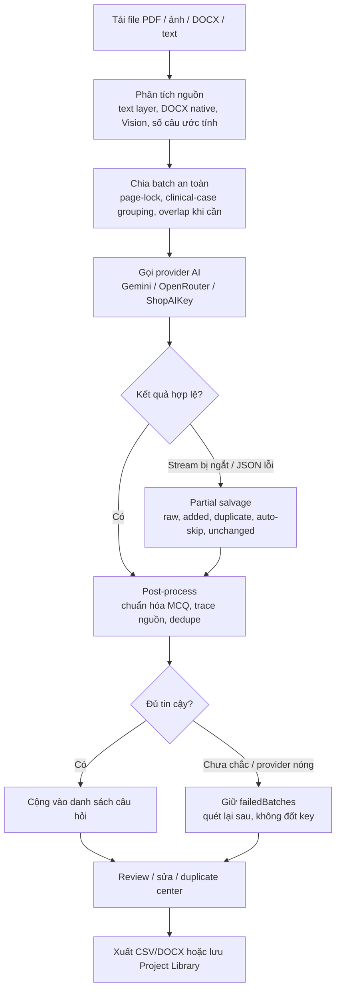

# 🧠 MCQ AnkiGen Pro — Từ Tài Liệu Đến Thẻ Anki Trong Vài Phút

> **Biến mọi tài liệu Y khoa (scan mờ, ảnh chụp vội, PDF nặng) thành bộ thẻ Anki chất lượng cao chỉ trong vài phút.**
> *Developed by [PonZ](https://github.com/tranhoait123)*
>
> **Phiên bản hiện tại: v8**
>
> **Bản cập nhật mới nhất: v8 — Free-tier Safe Recovery, Partial Rescue rõ ràng, Clinical Case Guard**

---

[ [🇻🇳 Tiếng Việt](README.md) | [🇺🇸 English](README.en.md) ]

## 📑 Mục Lục

1. [Giới thiệu](#-giới-thiệu)
2. [⚡ Dùng Online — Không Cần Cài Đặt](#-dùng-online--không-cần-cài-đặt)
3. [🧩 Tính Năng Chính](#-tính-năng-chính)
4. [📥 Định Dạng Hỗ Trợ](#-định-dạng-hỗ-trợ)
5. [🎬 Video Hướng Dẫn & File Mẫu](#-video-hướng-dẫn--file-mẫu)
6. [🔑 Lấy Google Gemini API Key (Miễn phí)](#-lấy-google-gemini-api-key-miễn-phí)
7. [🌐 Hướng dẫn sử dụng chi tiết](#-hướng-dẫn-sử-dụng-chi-tiết)
8. [📤 Xuất File](#-xuất-file)
9. [📲 Import CSV vào Anki](#-import-csv-vào-anki)
10. [💻 Cài đặt chạy trên máy (Tùy chọn)](#-cài-đặt-chạy-trên-máy-tùy-chọn)
11. [🐍 Phiên bản Streamlit (Python)](#-phiên-bản-streamlit-python)
12. [🧪 Kiểm Thử & Build](#-kiểm-thử--build)
13. [🎯 Mẹo nâng cao & Xử lý lỗi](#-mẹo-nâng-cao--xử-lý-lỗi)
14. [❓ Câu hỏi thường gặp (FAQ)](#-câu-hỏi-thường-gặp-faq)

---

## 🧠 Giới Thiệu

**MCQ AnkiGen Pro** là công cụ mã nguồn mở giúp bạn:

| Tính năng | Mô tả |
|:---|:---|
| 🤖 **Trích xuất MCQ 3.0** | Công cụ AI thế hệ mới, tự động sửa lỗi quét mờ, gối đầu trang và xử lý JSON ổn định |
| 🛡️ **Free-tier Safe Recovery V8** | Khi gặp 429/503, app ưu tiên giữ `failedBatches` để quét lại sau thay vì xoay quá nhiều key hoặc rescue dồn dập |
| 🩺 **Giải thích như Giáo sư Y khoa** | Mỗi câu hỏi đều kèm: đáp án cốt lõi, phân tích sâu, bằng chứng y văn, cảnh báo lâm sàng |
| 💾 **Pro Storage (IndexedDB)** | Dữ liệu được lưu an toàn với ID duy nhất — không lo mất dữ liệu khi reload hay lỗi trình duyệt |
| ⏯️ **Pause / Resume an toàn** | Có thể tạm dừng, reload rồi tiếp tục từ checkpoint batch an toàn mà không phải tải file lại từ đầu |
| 🔄 **Lọc trùng Y khoa (95%)** | Thuật toán so sánh nội dung đạt độ chính xác 95%, nhận diện logic phủ định (KHÔNG/NGOẠI TRỪ) |
| 🌙 **Dark Mode & Split View** | Học đêm không mỏi mắt, đối chiếu tài liệu gốc và kết quả song song |

### Quy trình tổng quát

```text
Tài liệu gốc → AI quét/ước tính số câu → AI trích xuất MCQ → lọc trùng → chỉnh sửa → xuất CSV/DOCX → học hoặc import Anki
```

### Sơ đồ cách app xử lý



**Có 3 cách sử dụng:**

1. **⚡ Truy cập Online** — Nhanh nhất, không cần cài đặt gì cả *(khuyên dùng)*
2. **💻 Cài đặt trên máy (Node.js)** — Chạy offline, toàn quyền kiểm soát
3. **🐍 Streamlit App (Python)** — Giao diện đơn giản hơn, chạy nhanh qua Python

---

## ⚡ Dùng Online — Không Cần Cài Đặt

> **Đây là cách đơn giản nhất để bắt đầu** — chỉ cần trình duyệt và API Key!

### 👉 Truy cập ngay: [mcqankigen.drponz.com](https://mcqankigen.drponz.com/)

Ứng dụng đã được deploy online, bạn có thể sử dụng **ngay lập tức** trên mọi thiết bị (PC, Mac, điện thoại, tablet) mà **không cần cài đặt bất cứ thứ gì**.

### Chỉ cần 3 bước:

```
 ┌──────────────────────────────────────────────────────────────┐
 │                                                              │
 │   Bước 1 ─ Mở  https://mcqankigen.drponz.com/               │
 │   Bước 2 ─ Lấy API Key miễn phí (xem hướng dẫn bên dưới)   │
 │   Bước 3 ─ Tải file lên → Quét → Trích xuất → Xuất CSV!     │
 │                                                              │
 └──────────────────────────────────────────────────────────────┘
```

| Ưu điểm | Chi tiết |
|:---|:---|
| ✅ **Không cần cài đặt** | Mở link, dùng ngay |
| ✅ **Miễn phí 100%** | Chỉ cần API Key Google (miễn phí) |
| ✅ **Đầy đủ tính năng** | Dark Mode, Split View, chỉnh sửa, lọc, xuất CSV/DOCX |
| ✅ **Mọi thiết bị** | PC, Mac, điện thoại, tablet — chỉ cần trình duyệt |
| ✅ **Dữ liệu an toàn** | Mọi xử lý diễn ra trên trình duyệt, không lưu trên server |
| ✅ **Luôn cập nhật** | Tự động có phiên bản mới nhất mỗi khi truy cập |

> 💡 **Trên điện thoại:** Bạn có thể thêm trang web vào màn hình chính (Add to Home Screen) để sử dụng như một ứng dụng native!

---

## 🧩 Tính Năng Chính

| Nhóm | Chi tiết |
|:---|:---|
| **AI Engine linh hoạt** | Hỗ trợ Google Gemini, OpenRouter và ShopAIKey. Khi chọn provider mới, app tự đổi model tương thích để tránh lỗi endpoint. |
| **Key Rotator free-tier-safe** | Nhiều API key được xoay có giới hạn; key 403 bị loại tạm thời, 429 chỉ thử key hiện tại + 1 key dự phòng, 503/429 liên tiếp sẽ giữ batch lỗi để quét lại sau. |
| **PDF Safe Hybrid** | PDF được kiểm tra text layer từng trang bằng rule cực gắt; batch sạch dùng text-first nhanh hơn, batch nghi ngờ/scan/2 cột/bảng vẫn dùng Vision/PDF raw với overlap để tránh mất câu. |
| **DOCX Hybrid thông minh** | Word có text thật được đọc trực tiếp từ `word/document.xml`, `numbering.xml`, `styles.xml`; nếu có ảnh nhúng trong `word/media/*`, app quét thêm từng ảnh bằng Vision để không bỏ câu nằm trong ảnh. |
| **Chế độ nhanh** | Có tùy chọn bỏ qua bước phân tích ban đầu để tiết kiệm token và bắt đầu trích xuất nhanh hơn. |
| **Giải thích giàu ngữ cảnh** | Mỗi câu có `Đáp án cốt lõi`, `Bằng chứng`, `Phân tích sâu`, `Cảnh báo lâm sàng`, `Nguồn`, `Độ khó`, `Tư duy`. |
| **Resume Session an toàn** | Nếu đang chạy dở mà refresh/reload, app sẽ khôi phục file, MCQ đã checkpoint và cho phép tiếp tục từ batch an toàn gần nhất. |
| **Partial Rescue minh bạch** | Log và toast phân biệt `raw`, `added`, `duplicates`, `autoSkipped`, `unchanged`, `expected` để biết câu nào đã thật sự được cộng và batch nào còn cần quét lại. |
| **Clinical Case Guard** | App nhóm ca lâm sàng, khóa theo trang/khoảng trang và tránh dedupe nhầm các câu liền kề có chung bệnh cảnh nhưng hỏi mục tiêu khác nhau. |
| **Source/Page Trace V7** | Mỗi câu có metadata nguồn rõ hơn: file, trang/khoảng trang, batch và đoạn trích ngắn; bấm chip nguồn để mở Split View đối chiếu tài liệu gốc. |
| **Thư viện Bộ đề V7** | Sau khi trích xuất xong, app tự lưu project local vào IndexedDB; có thể đổi tên, mở lại, xuất lại CSV/DOCX, xóa project và so sánh với bộ đang mở. |
| **Duplicate Review nâng cấp** | Câu nghi trùng không bị xóa mù; app chọn match tốt nhất, tránh auto-skip khi xung đột đáp án và có trung tâm review để giữ/bỏ/ghi đè an toàn hơn. |
| **UI lớn vẫn mượt** | List nhiều trăm câu được tối ưu render, toolbar gọn hơn, modal duplicate sạch hơn để đỡ lag và đỡ rối mắt. |
| **Export kép** | CSV chuẩn Anki và DOCX để học/in trực tiếp, có xử lý bảng Markdown và căn chỉnh đẹp. |
| **Bảo toàn dữ liệu** | Câu hỏi, cài đặt và cache được lưu local bằng IndexedDB/localStorage; reload trang không làm mất kết quả. |
| **Mobile/PWA Polish V7** | Header gọn hơn trên màn hình nhỏ, có bottom action bar cho thao tác chính và banner báo bản cập nhật PWA mới. |
| **Confirm Modal an toàn** | Các thao tác xóa câu, xóa dữ liệu, xóa cache dùng modal trong app thay vì popup trình duyệt, giảm bấm nhầm trên mobile. |
| **PWA** | Có thể cài như app trên desktop/mobile nếu trình duyệt hỗ trợ. |

---

## 📥 Định Dạng Hỗ Trợ

### Đầu vào

| Định dạng | Ghi chú |
|:---|:---|
| **PDF** | Phù hợp đề scan, tài liệu nhiều trang; app tự chia nhỏ để xử lý. |
| **Ảnh** | PNG, JPG, JPEG, WebP, HEIC. Nên chụp thẳng góc, đủ sáng. |
| **Word** | DOCX. Nếu có text thật, app dùng DOCX native; nếu chỉ là ảnh scan, app sẽ khuyên xuất sang PDF/ảnh để quét Vision. |
| **Text/Markdown** | TXT, MD. |
| **CSV** | Có thể nhập lại dữ liệu đã xuất hoặc dữ liệu MCQ dạng bảng để tiếp tục chỉnh/sàng lọc. |

### Đầu ra

| Định dạng | Dùng để làm gì |
|:---|:---|
| **CSV Anki** | Import vào Anki với note type `3MCQ`; hỗ trợ HTML trong phần giải thích. |
| **DOCX Study Export** | Tài liệu học trực tiếp, dễ in, có câu hỏi, đáp án, giải thích, bảng và metadata. |

---

## 🎬 Video Hướng Dẫn & File Mẫu

### Video Demo

Xem video demo toàn bộ quy trình từ tải file → trích xuất → xuất CSV → import Anki:

https://github.com/user-attachments/assets/huong-dan-su-dung.mov

> 📹 File video có sẵn trong repo: [`Hướng dẫn sử dụng.mov`](./Hướng%20dẫn%20sử%20dụng.mov)

### 📦 File Mẫu — Xem Thành Quả Ngay

Muốn xem kết quả thực tế trước khi bắt đầu? Import file demo vào Anki để trải nghiệm:

| File | Mô tả | Tải |
|:---|:---|:---|
| **DEMO.apkg** | 🎉 Bộ thẻ mẫu đã trích xuất sẵn — xem thành quả thực tế | [📥 Tải DEMO.apkg](./DEMO.apkg) |
| **3MCQ.apkg** | 📋 Note Type "3MCQ" tối ưu cho app — dùng khi import CSV | [📥 Tải 3MCQ.apkg](./3MCQ.apkg) |

> 💡 Mở Anki → **File → Import** → chọn file `DEMO.apkg` để xem ngay bộ thẻ trắc nghiệm mẫu với đầy đủ câu hỏi, đáp án và giải thích chi tiết!

---

## 🔑 Lấy Google Gemini API Key (Miễn Phí)

API Key là "chìa khóa" để ứng dụng giao tiếp với AI của Google. Bạn được sử dụng **hoàn toàn miễn phí** trong giới hạn cá nhân.

### Các bước thực hiện:

**Bước 1:** Truy cập [Google AI Studio](https://aistudio.google.com/app/apikey)

**Bước 2:** Đăng nhập bằng tài khoản Google của bạn

**Bước 3:** Nhấn nút **"Create API Key"** (Tạo API Key)

**Bước 4:** Chọn một dự án Google Cloud (hoặc để mặc định), rồi nhấn **"Create"**

**Bước 5:** Sao chép API Key hiển thị (dạng `AIzaSy...`) — lưu lại cẩn thận!

> ⚠️ **Bảo mật API Key:** Không chia sẻ Key cho người khác.

### 🔥 Mẹo: Tạo thêm API Key từ nhiều Project để có dự phòng an toàn

Mỗi API Key thuộc một **Google Cloud Project**, và mỗi Project có **quota miễn phí riêng biệt**. Có thêm vài key dự phòng giúp app chuyển nhẹ khi một key chạm giới hạn, nhưng v8 vẫn ưu tiên **chờ cooldown/quét lại phần lỗi** thay vì xoay quá nhiều key trong một phút.

#### Cách tạo nhiều Key:

**Bước 1:** Vào [Google AI Studio → API Keys](https://aistudio.google.com/app/apikey)

**Bước 2:** Nhấn **"Create API Key"**

**Bước 3:** Ở mục **"Google Cloud Project"**, nhấn **"Create new project"** (Tạo dự án mới) thay vì chọn project cũ

**Bước 4:** Đặt tên project (VD: `anki-key-2`, `anki-key-3`...) → Nhấn **"Create"**

**Bước 5:** Lặp lại Bước 2-4 để tạo thêm Key từ các Project khác nhau

> 💡 **Mỗi Project = 1 quota miễn phí riêng.** Ví dụ:
> - Project 1 → Key `AIzaSyA...` (quota riêng)
> - Project 2 → Key `AIzaSyB...` (quota riêng)
> - Project 3 → Key `AIzaSyC...` (quota riêng)
>
> **Khuyên dùng:** 2-5 key từ các Project khác nhau là đủ cho đa số ca học cá nhân. Nếu provider báo 429/503 liên tiếp, hãy để app giữ batch lỗi rồi quét lại sau thay vì cố chạy dồn.

#### Cách nhập nhiều Key vào ứng dụng:

Vào **⚙️ Cài đặt → Google Gemini API Key**, dán tất cả Key cách nhau bằng **dấu phẩy** `,`:

```
AIzaSyA...,AIzaSyB...,AIzaSyC...
```

Hệ thống sẽ **tự động xoay vòng có giới hạn**. Với lỗi 429 mềm, app chỉ thử key hiện tại và tối đa 1 key dự phòng cho mỗi lượt xử lý, sau đó chờ cooldown hoặc giữ batch để quét lại sau.

---

## 🌐 Hướng Dẫn Sử Dụng Chi Tiết

> Các bước dưới đây áp dụng cho **cả bản online** ([mcqankigen.drponz.com](https://mcqankigen.drponz.com/)) **lẫn bản cài trên máy**. Giao diện hoàn toàn giống nhau.

### Bước 1: Cấu hình API Key & Model AI

1. Nhấn vào **biểu tượng ⚙️ (Cài đặt)** ở góc trên bên phải
2. Cửa sổ **"Cài đặt hệ thống"** sẽ hiện ra:

| Mục | Hướng dẫn |
|:---|:---|
| **AI Engine** | Chọn provider: Google Gemini, OpenRouter hoặc ShopAIKey. Người mới nên dùng Google Gemini. |
| **Google Gemini API Key** | Dán API Key bạn đã lấy ở bước trên. Có thể nhập nhiều key cách nhau bằng dấu phẩy để dự phòng, nhưng app sẽ xoay có giới hạn để bảo vệ free tier. |
| **OpenRouter / ShopAIKey API Key** | Dùng khi muốn gọi model qua gateway khác. OpenRouter hữu ích nếu muốn thử Claude, GPT, DeepSeek hoặc Gemini qua router. |
| **Mô hình AI (Model)** | Chọn model phù hợp. **Khuyên dùng: `Gemini 3.1 Flash-Lite`** — nhanh và chính xác nhất. |
| **Vai trò AI** | Chọn vai trò cho AI theo môn học: **Y Khoa**, **Tiếng Anh**, **Luật**, **CNTT** — hoặc tự viết vai trò riêng. |

3. Nhấn **"Đã Xong"** để lưu.

> 💡 **Mẹo chọn Model:**
> - **Gemini 3.1 Flash-Lite** — Nhanh nhất, phù hợp phần lớn trường hợp *(khuyên dùng)*
> - **Gemini 2.5 Flash (Thinking)** — **Model ổn định nhất** cho việc quét lỗi và trích xuất y khoa chuyên sâu
> - **Gemini 3 Pro** — Tư duy Y khoa sâu nhất, nhưng chậm hơn

### Thiết lập nâng cao

| Tùy chọn | Khi nào nên dùng |
|:---|:---|
| **Trích xuất nhanh (Skip Analysis)** | Khi đã biết rõ file có bao nhiêu câu hoặc muốn tiết kiệm token. |
| **Xóa bộ nhớ đệm** | Khi muốn làm mới dữ liệu cache, đổi tài liệu/model nhiều lần, hoặc nghi cache cũ làm kết quả không khớp. |
| **System Instruction tùy chỉnh** | Khi làm môn khác Y khoa hoặc muốn AI giải thích theo phong cách riêng của giảng viên/bộ môn. |

---

### Bước 2: Tải tài liệu lên

Ở phần **Control Panel** (bên trái màn hình):

1. **Kéo thả file** vào vùng tải lên, hoặc **nhấn vào vùng đó** để chọn file
2. Hệ thống hỗ trợ các định dạng:
   - 📄 **PDF** (tối đa 50MB/file)
   - 🖼️ **Ảnh** (PNG, JPG, JPEG, WebP, HEIC)
   - 📝 **Word** (DOCX)
   - 📋 **Text** (TXT, MD)
3. Có thể tải **nhiều file cùng lúc**
4. Sau khi tải xong, mỗi file hiển thị trạng thái **"Đã sẵn sàng"**

> ⚠️ **Với file scan/ảnh chụp đề thi**: Để đạt kết quả tốt nhất, hãy:
> - Chụp **thẳng góc**, đủ sáng, không bị mờ
> - Tránh để **ngón tay che chữ**
> - Nếu chữ viết tay đè nhiều, AI sẽ cố "nhìn xuyên qua" nhưng độ chính xác có thể giảm

#### Trạng thái xử lý DOCX

Khi tải file Word, app tự chẩn đoán và hiển thị một trong ba trạng thái:

| Trạng thái | Ý nghĩa | Hành động tối ưu |
|:---|:---|:---|
| **DOCX native: N câu** | App đọc trực tiếp XML của Word, tách được MCQ từ A/B/C/D hoặc auto-list, giữ highlight vàng/chữ đỏ làm đáp án đúng. | Dùng luôn, đây là đường nhanh và chính xác nhất. |
| **DOCX hybrid: N câu / M ảnh** | App tách được câu hỏi từ text Word và phát hiện ảnh nhúng cần quét Vision. | Dùng luôn; app xử lý text trước rồi quét từng ảnh để tránh bỏ câu trong ảnh. |
| **DOCX structured: N câu** | App tách được block câu hỏi nhưng chưa đủ marker đáp án chắc chắn. | Dùng luôn; AI sẽ nhận từng batch 8-10 câu và suy luận đáp án còn thiếu. |
| **DOCX text fallback** | Word có text nhưng cấu trúc A/B/C/D không đủ rõ để tách native. | App tự dùng văn bản sạch cho AI quét, không cần chuyển file. |
| **Nên dùng PDF/Ảnh** | Word gần như không có text thật, thường là ảnh scan dán trong DOCX. | Xuất Word sang PDF hoặc ảnh rõ rồi tải lại để dùng Vision. |

---

### Bước 3: Quét & Trích xuất câu hỏi

Quy trình gồm **2 giai đoạn** tuần tự:

#### Giai đoạn 1 — Quét tài liệu (Scan)

1. Nhấn nút **"🛰️ QUÉT TÀI LIỆU"**
2. AI sẽ phân tích tài liệu và cho biết:
   - **Chủ đề** (VD: "Nhi khoa - Bệnh lý hô hấp")
   - **Số câu hỏi ước tính** (VD: 45 câu)
3. Khi hiện **"Hệ thống đã sẵn sàng"** → Chuyển sang giai đoạn 2

#### Giai đoạn 2 — Trích xuất câu hỏi (Extract)

1. Nhấn nút **"✨ TRÍCH XUẤT CÂU HỎI"**
2. Hệ thống sẽ:
   - Kiểm tra text layer PDF từng trang
   - Batch text sạch được tách MCQ trước và chia 10 câu/batch
   - Batch nghi ngờ/scan vẫn cắt PDF thành từng phần nhỏ (3 trang/phần, có gối đầu)
   - Quét theo số luồng bạn chọn *(mặc định 1 luồng để ổn định hơn với key miễn phí)*
   - Khi có 429/503, app retry có giới hạn, không kiểm tra key hàng loạt và không xoay quá nhiều key trong một operation
   - Nếu provider đang nóng, app giữ batch lỗi trong danh sách **Quét lại phần lỗi** thay vì tạo thêm nhiều request
   - Tự lọc trùng lặp
3. **Thanh tiến trình** hiển thị real-time số câu đã trích xuất

> 💡 Nếu lỡ reload khi đang chạy, app có thể khôi phục phiên dang dở và tiếp tục từ checkpoint batch an toàn gần nhất.

> 📝 Nếu số câu trích xuất **thấp hơn 80%** so với ước tính, hệ thống sẽ tự động chạy **Kiểm toán (Audit)** để phân tích lý do thiếu và đưa ra lời khuyên.

---

### Bước 4: Xem, chỉnh sửa & lọc kết quả

Sau khi trích xuất xong, kết quả hiển thị ở **panel bên phải**:

#### 🔍 Thanh công cụ

| Nút | Chức năng |
|:---|:---|
| **🔎 Tìm kiếm** | Gõ từ khóa để lọc câu hỏi |
| **📊 Lọc độ khó** | Lọc theo Easy / Medium / Hard |
| **✏️ Soạn thảo / 👁️ Review** | Chuyển giữa chế độ chỉnh sửa và xem trước giao diện Anki |
| **⚠️ Lọc Cảnh Báo** | Chỉ hiện câu hỏi có cảnh báo lâm sàng |

#### ✏️ Chỉnh sửa câu hỏi

- Hover lên bất kỳ câu hỏi nào → hiện 2 nút:
  - **🖊 Sửa** — Chỉnh sửa câu hỏi, đáp án, giải thích
  - **🗑 Xóa** — Xóa câu hỏi khỏi danh sách
- Khi chỉnh sửa:
  - Nhấn **"Lưu thay đổi"** hoặc `Ctrl+Enter` để lưu
  - Nhấn **"Hủy bỏ"** hoặc `Escape` để hủy

#### 🔀 Chế độ Split View (So sánh)

Nhấn nút **📊 (Columns)** ở Header để bật **Split View**:
- **Bên trái**: Hiển thị tài liệu gốc (PDF/Ảnh)
- **Bên phải**: Hiển thị câu hỏi đã trích xuất
- Giúp bạn **đối chiếu** xem AI có trích xuất đúng không

#### 📍 Source/Page Trace V7 — bấm nguồn để nhảy về tài liệu gốc

Từ v7, mỗi câu hỏi không chỉ có trường `Nguồn` dạng chữ, mà còn có trace metadata để đối chiếu nhanh hơn:

| Thành phần trace | Ý nghĩa |
|:---|:---|
| **File** | Tên file gốc chứa câu hỏi. |
| **Trang / khoảng trang** | Với PDF, app lưu trang hoặc khoảng trang batch như `Trang 2` hoặc `Trang 2-4`. |
| **Nhóm / batch** | Với DOCX/text/PDF text-layer, app ghi thêm nhóm xử lý để dễ dò khi tài liệu dài. |
| **Đoạn trích ngắn** | Snippet lấy từ batch text hoặc nội dung câu hỏi để bạn có thêm ngữ cảnh khi hover/click. |

Cách dùng:

1. Sau khi trích xuất xong, mở danh sách kết quả.
2. Ở cuối mỗi card câu hỏi, tìm chip **Nguồn: ...**.
3. Bấm chip nguồn:
   - App tự bật **Split View** nếu đang tắt.
   - Với PDF, preview sẽ mở tới trang bắt đầu của trace bằng `#page=...`.
   - Với ảnh/DOCX/text, app mở đúng file gốc trong panel xem trước nếu file còn trong phiên.
4. Đọc snippet/nguồn để so lại câu hỏi, lựa chọn và đáp án trước khi export.

Lưu ý:

- Trace V7 ưu tiên **ổn định và an toàn**: file + trang/khoảng trang + snippet, chưa dùng bounding box OCR.
- Với PDF scan hoặc batch Vision có overlap, một câu có thể nằm trong khoảng trang thay vì một trang duy nhất.
- Trường `Source` trong CSV/DOCX vẫn được giữ như trước để không làm vỡ workflow Anki cũ.

#### 🗂️ Thư viện Bộ đề V7 — lưu, mở lại, xuất lại project

Từ v7, app tự lưu một snapshot project vào IndexedDB sau khi trích xuất hoàn tất và có câu hỏi hợp lệ.

| Chức năng | Cách dùng |
|:---|:---|
| **Mở thư viện** | Bấm icon **Thư viện** trên Header; trên điện thoại có thêm nút ở bottom action bar. |
| **Auto-save project** | Sau khi nhấn **Trích xuất câu hỏi** và có kết quả, app tự lưu project gồm file, câu hỏi, duplicate, phân tích và thống kê. |
| **Đổi tên** | Mở project trong thư viện → sửa ô tên → bấm icon bút chì. |
| **Mở lại project** | Bấm **Mở lại** để đưa file/câu hỏi của project vào workspace hiện tại. |
| **Xuất lại CSV/DOCX** | Bấm **CSV** hoặc **DOCX** ngay trong thư viện, không cần mở lại project trước. |
| **Xóa project** | Bấm **Xóa** trong thư viện; app sẽ hiện confirm modal trước khi xóa. |
| **So sánh** | Chọn project trong thư viện để xem số câu mới, câu mất, câu đổi đáp án và câu nghi trùng so với bộ đang mở. |

Quy tắc lưu project:

- Nếu bạn đang mở một project và chạy lại cùng bộ file, app sẽ cập nhật snapshot project đó.
- Nếu bạn clear/re-upload bộ file khác, app tạo project mới.
- Project library là **local-only** trong IndexedDB của trình duyệt, không đồng bộ cloud.
- **Xóa dữ liệu hiện tại** không xóa thư viện project; muốn xóa project phải vào thư viện và xóa riêng.

#### 📱 Mobile/PWA V7 — thao tác nhanh trên điện thoại

Trên màn hình nhỏ, app có thêm **bottom action bar** để thao tác nhanh:

| Trạng thái | Nút chính |
|:---|:---|
| Chưa quét | **Quét** |
| Đã quét xong | **Trích xuất** |
| Đang xử lý | **Tạm dừng / Tiếp tục** |
| Có kết quả | **Xuất CSV**, **Xuất DOCX**, **Thư viện**, **Cài đặt**, **Dark/Light** |

PWA update banner:

- Khi có bản app mới, app hiện banner **"Có bản cập nhật mới"**.
- Bấm **Cập nhật** để reload sang phiên bản mới nhất.
- Nếu đang xử lý tài liệu dài, nên bấm **Tạm dừng** hoặc chờ batch hiện tại xong trước khi cập nhật để giữ checkpoint sạch.

#### ✅ Confirm Modal V7 — chống bấm nhầm khi xóa

Các thao tác sau sẽ hiện modal xác nhận trong app:

- Xóa một câu hỏi.
- Xóa dữ liệu hiện tại.
- Xóa cache AI trong Cài đặt.
- Xóa project khỏi Thư viện.

Ghi chú quan trọng:

- **Xóa dữ liệu hiện tại**: xóa file đang mở, câu hỏi hiện tại, session dang dở và cache AI; **không xóa Thư viện project**.
- **Xóa cache AI**: chỉ xóa Context Cache/Markdown Cache để lần sau AI đọc lại file; không xóa câu hỏi, file hiện tại hoặc project đã lưu.
- Modal có trạng thái đang xử lý để tránh double-click gây xóa lặp.

---

### Bước 5: Xuất file

Khi đã hài lòng với kết quả:

| Nút | Chức năng |
|:---|:---|
| **📥 Xuất CSV Anki** | Tải file `.csv` về máy, sẵn sàng import vào Anki |
| **📄 Xuất DOCX** | Tạo tài liệu học trực tiếp dạng `.docx`, có câu hỏi, đáp án, giải thích, bảng Markdown và metadata |

File CSV có các cột:
```
Question | A | B | C | D | E | CorrectAnswer | ExplanationHTML | Source
```

> File CSV đã được format chuẩn **UTF-8 BOM** để đảm bảo hiển thị tiếng Việt đúng trên mọi phần mềm.

---

### 🌙 Các tính năng bổ sung

| Tính năng | Mô tả |
|:---|:---|
| **Dark Mode** | Nhấn icon ☀️/🌙 ở Header để chuyển đổi |
| **Lưu trữ Pro (Safe)** | Dữ liệu được gán ID duy nhất và lưu trong IndexedDB — tuyệt đối không mất dữ liệu |
| **Thư viện Bộ đề** | Tự lưu project sau mỗi lần trích xuất thành công; mở lại, đổi tên, export lại và so sánh với bộ hiện tại |
| **Trace nguồn** | Bấm chip nguồn trên card để mở Split View và nhảy về file/trang/khoảng trang gốc |
| **Pause / Resume** | Có thể tạm dừng khi đang xử lý; reload xong vẫn có thể tiếp tục từ checkpoint an toàn |
| **Trung tâm Trùng lặp** | Giao diện Review chuyên nghiệp để đối chiếu và quyết định Giữ lại/Bỏ qua/Ghi đè câu hỏi trùng |
| **Cài đặt PWA** | Nếu trình duyệt hỗ trợ, nút **"📲 Tải App"** xuất hiện — cài app về máy như ứng dụng native |
| **Banner cập nhật PWA** | Khi có bản mới, app báo cập nhật để reload có kiểm soát |
| **Bottom action bar mobile** | Trên điện thoại, các nút Quét/Trích xuất/Tạm dừng/Xuất/Thư viện/Cài đặt nằm dưới màn hình |
| **Xoay tua API Key** | Tự động đổi key khi gặp lỗi 429/503/403, cooldown key lỗi hợp lý và tận dụng key free hiệu quả hơn |

---

## 📤 Xuất File

### CSV cho Anki

CSV là định dạng chính để đưa câu hỏi vào Anki. App tự:

1. Chuẩn hóa câu hỏi và đáp án A-E.
2. Quy đổi đáp án đúng thành chữ cái A/B/C/D/E khi có thể.
3. Escape dấu ngoặc kép để CSV không vỡ cột.
4. Thêm UTF-8 BOM để tiếng Việt hiển thị đúng.
5. Đóng gói giải thích thành HTML đẹp cho mặt sau thẻ.

### DOCX để học trực tiếp

DOCX phù hợp khi bạn muốn đọc/in tài liệu mà chưa cần import Anki. File DOCX gồm:

- Tiêu đề tài liệu, ngày xuất và số câu.
- Câu hỏi, phương án, dấu chọn đáp án đúng.
- Đáp án cốt lõi, bằng chứng, phân tích sâu, cảnh báo.
- Bảng Markdown được chuyển thành bảng Word.
- Metadata: nguồn, độ khó, tư duy.

> Mẹo nhỏ: nếu nội dung AI trả về có bảng Markdown trong phần `Bằng chứng` hoặc `Phân tích sâu`, DOCX sẽ cố giữ bảng đúng dạng thay vì biến thành text thô.

---

## 📲 Import CSV Vào Anki

### Bước 1: Mở Anki Desktop

Tải Anki tại [apps.ankiweb.net](https://apps.ankiweb.net/) nếu chưa có.

### Bước 2: Chọn Note Type

#### ⚡ Cách nhanh: Dùng Note Type "3MCQ" có sẵn (Khuyên dùng)

Mình đã tạo sẵn Note Type **"3MCQ"** được tối ưu riêng cho ứng dụng này. Bạn chỉ cần:

1. 📥 Tải file [**3MCQ.apkg**](./3MCQ.apkg) (có sẵn trong repo)
2. Mở Anki → **File → Import** → chọn file `3MCQ.apkg` vừa tải
3. Note Type "3MCQ" sẽ tự động được thêm vào Anki — **xong, không cần làm gì thêm!**

> 💡 Note Type "3MCQ" đã được thiết kế sẵn template hiển thị đẹp với màu sắc, font chữ và bố cục tối ưu cho câu hỏi trắc nghiệm. Chỉ cần import là dùng ngay!
>
> 🎉 Muốn xem thành quả mẫu? Import file [**DEMO.apkg**](./DEMO.apkg) để xem bộ thẻ đã trích xuất sẵn với đầy đủ câu hỏi + giải thích chi tiết.

#### 🔧 Cách thủ công: Tự tạo Note Type

Nếu bạn muốn tự tạo, thực hiện như sau:

1. Vào **Tools → Manage Note Types → Add**
2. Tạo Note Type mới (VD: "MCQ Y Khoa") với các trường:
   - `Question`
   - `A`, `B`, `C`, `D`, `E`
   - `CorrectAnswer`
   - `ExplanationHTML`
   - `Source`

### Bước 3: Import CSV

1. Vào **File → Import**
2. Chọn file CSV đã xuất
3. Cấu hình:
   - **Type**: Chọn Note Type "3MCQ" (hoặc Note Type bạn tự tạo)
   - **Deck**: Chọn hoặc tạo bộ thẻ mới
   - **Field separator**: Comma
   - **Allow HTML in fields**: ✅ **BẬT** (quan trọng — để hiển thị giải thích đẹp)
4. Map các cột vào đúng trường
5. Nhấn **Import**

> 💡 Trường `ExplanationHTML` chứa HTML được format sẵn với màu sắc đẹp mắt. Hãy đặt nó trong phần **Back** (mặt sau) của thẻ Anki.

---

## 💻 Cài Đặt Chạy Trên Máy (Tùy Chọn)

> 📝 Phần này **chỉ dành cho bạn nào muốn chạy offline** trên máy tính cá nhân. Nếu bạn đang dùng bản online tại [mcqankigen.drponz.com](https://mcqankigen.drponz.com/), **bỏ qua phần này.**

### Yêu cầu hệ thống

| Thành phần | Yêu cầu |
|:---|:---|
| **Node.js** | v18 trở lên — [Tải tại đây](https://nodejs.org/) |
| **Git** *(tùy chọn)* | Để clone mã nguồn |

### Các bước cài đặt

**1. Tải mã nguồn:**

```bash
git clone https://github.com/tranhoait123/anki-mcq-export.git
cd anki-mcq-export
```

> 💡 Không quen Git? Vào trang [GitHub](https://github.com/tranhoait123/anki-mcq-export), nhấn **Code → Download ZIP**, rồi giải nén.

**2. Cài thư viện (chỉ chạy lần đầu):**

```bash
npm install
```

**3. Khởi chạy:**

```bash
npm run dev
```

Mở trình duyệt → truy cập **http://localhost:5173** → Sử dụng giống hệt bản online!

### Lệnh phát triển hữu ích

```bash
# chạy app dev
npm run dev

# chạy test
npm test

# build production
npm run build
```

### Công nghệ chính

| Thành phần | Công dụng |
|:---|:---|
| **React + Vite** | Giao diện web/PWA tốc độ cao. |
| **Zustand** | Quản lý state nhẹ, dễ bảo trì. |
| **IndexedDB** | Lưu MCQ/cache cục bộ trên trình duyệt. |
| **Google GenAI / OpenAI-compatible APIs** | Gọi Gemini/OpenRouter/ShopAIKey. |
| **pdf-lib + pdfjs-dist** | Chia PDF, kiểm tra text layer, rasterize PDF khi provider cần ảnh. |
| **mammoth** | Đọc nội dung DOCX đầu vào. |
| **docx** | Xuất tài liệu học `.docx`. |
| **Vitest** | Kiểm thử logic xuất Anki, DOCX, model registry, retry và dedupe. |

---

## 🐍 Phiên Bản Streamlit (Python)

Phiên bản đơn giản hơn, phù hợp nếu bạn muốn nhanh gọn.

```bash
# Cài đặt
pip install -r requirements.txt

# Chạy
streamlit run streamlit_app.py
```

Trình duyệt sẽ tự mở tại **http://localhost:8501**

1. **Sidebar:** Nhập **Gemini API Key** + Chọn **Model**
2. **Control Center:** Tải file lên → Nhấn **"🚀 BẮT ĐẦU TRÍCH XUẤT"**
3. **Kết quả:** Xem câu hỏi + Nhấn **"💾 TẢI XUỐNG CSV ANKI"**

---

## 🧪 Kiểm Thử & Build

Trước khi deploy hoặc sửa code lớn, nên chạy:

```bash
npm test
npm run build
```

Bộ test hiện bao phủ các phần quan trọng:

| Nhóm test | Mục tiêu |
|:---|:---|
| **Anki HTML** | Escape HTML nguy hiểm, format bảng/blockquote/markdown cơ bản. |
| **DOCX Export** | Tạo blob DOCX thật, xử lý thiếu option E, sanitize text, parse bảng Markdown. |
| **DOCX Native Parser** | Đọc `word/document.xml`, `word/numbering.xml`, `word/styles.xml`, giữ highlight vàng/chữ đỏ/shading/tick, hiểu auto-list của Word, tách MCQ 4/5 lựa chọn và chia batch 10 câu; DOCX có ảnh nhúng sẽ thêm Vision batch cho từng ảnh. |
| **Dedupe** | Nhận diện câu trùng có nhiễu OCR, bỏ qua trường hợp logic phủ định bị đảo. |
| **Model Registry** | Kiểm tra model theo provider, fallback vision và normalize alias. |
| **Retry Strategy** | Phân loại lỗi quota/server/format và chia nhỏ nội dung khi cần rescue. |
| **Brain/API** | Dịch lỗi provider, build request OpenAI-compatible, fallback JSON mode. |
| **Resume / Session** | Kiểm tra checkpoint phiên dang dở, resume an toàn sau reload và không kéo lại batch đang chạy dở. |
| **Key Rotation** | Kiểm tra adaptive concurrency, cooldown đúng loại lỗi và xoay key an toàn khi key chết/quá tải. |
| **Partial Rescue** | Kiểm tra stream bị ngắt, số raw parse được, số câu thật sự thêm, duplicate/auto-skip/unchanged và failedBatches còn cần quét lại. |
| **Free-tier Safety** | Kiểm tra 429 chỉ thử tối đa 2 key/op, 503 fast-fail đúng profile và deferred recovery không chạy dồn khi Google đang nóng. |

---

## 🎯 Mẹo Nâng Cao & Xử Lý Lỗi

### ❌ Lỗi thường gặp

| Lỗi | Nguyên nhân | Giải pháp |
|:---|:---|:---|
| **"Vui lòng nhập API Key"** | Chưa nhập Key | Vào ⚙️ Cài đặt → Dán API Key |
| **Lỗi 429 (Quota exceeded)** | Vượt giới hạn miễn phí | Nhập thêm Key từ Project mới, cách nhau bằng dấu phẩy |
| **Số câu trích xuất ít** | Tài liệu mờ / viết tay nhiều | Chụp lại rõ hơn; thử model `Gemini 3 Pro` |
| **Kết quả rỗng** | File bị hỏng hoặc mã hóa | Thử convert sang PDF mới, hoặc chụp ảnh lại |
| **Lỗi "Empty response"** | API không phản hồi | Thử lại sau vài giây, hoặc đổi sang Key/Model khác |
| **Model không khớp provider** | Chọn model OpenRouter/ShopAIKey nhưng provider đang là Google, hoặc ngược lại | Vào Cài đặt chọn đúng AI Engine; app thường sẽ tự coerce model tương thích. |
| **OpenRouter báo không hỗ trợ response_format** | Một số model không hỗ trợ JSON mode native | App tự retry bằng prompt-only JSON mode; nếu vẫn lỗi, đổi model Gemini/DeepSeek khác. |
| **PDF không đọc được qua OpenRouter/ShopAIKey** | Provider không nhận PDF raw | App sẽ chuyển PDF thành ảnh; nếu file quá nặng, chia nhỏ PDF trước khi tải lên. |
| **PDF Safe Hybrid vẫn dùng Vision** | Text layer scan, rối, thiếu A/B/C/D hoặc nhiều ký tự lạ | Đây là cơ chế an toàn để tránh mất câu; app chỉ dùng text-first khi batch thật sạch. |
| **PDF text thật nhưng vẫn chậm** | App phát hiện rủi ro 2 cột, bảng, option thiếu thứ tự hoặc quá ít block MCQ | Đây là Ultra Safe guardrail; chấp nhận chậm hơn để giảm nguy cơ thiếu câu. |
| **Reload rồi tiếp tục nhưng batch tăng mà số câu không tăng** | Phiên cũ đang dùng cache/batch context lỗi thời hoặc đang tiếp tục từ bản app cũ | Hãy reload bằng phiên bản mới nhất rồi bấm **Tiếp tục phiên dang dở**; v6 đã siết lại resume batch để bám đúng chunk hiện tại. |
| **Bấm nguồn nhưng không nhảy đúng trang** | File không phải PDF, file gốc không còn trong phiên, hoặc batch Vision chỉ có khoảng trang | Mở lại project từ Thư viện nếu cần khôi phục file; với PDF scan hãy kiểm tra khoảng trang hiển thị ở chip nguồn. |
| **Không thấy project trong Thư viện** | Chưa trích xuất xong, kết quả rỗng, hoặc IndexedDB của trình duyệt bị xóa | Chạy trích xuất lại đến khi có câu hỏi hợp lệ; tránh dùng chế độ xóa dữ liệu trình duyệt nếu muốn giữ thư viện. |
| **Mở project cũ làm mất bộ đang xem** | Nút **Mở lại** thay workspace hiện tại bằng snapshot project đã lưu | Nếu cần giữ bộ hiện tại, xuất CSV/DOCX hoặc để app auto-save xong rồi hãy mở project khác. |
| **So sánh project báo câu mới/câu mất nhiều** | Nội dung câu hỏi bị AI diễn đạt khác giữa hai lần chạy hoặc thứ tự câu thay đổi | Dùng mục `Đổi đáp án` và `Nghi trùng` để rà các câu quan trọng trước khi export/import Anki. |
| **Banner PWA cứ hiện cập nhật** | Service worker phát hiện bản build mới | Bấm **Cập nhật** sau khi đã tạm dừng hoặc hoàn tất phiên đang xử lý. |
| **Xóa cache nhưng câu hỏi vẫn còn** | Đây là hành vi đúng của v7 | Xóa cache chỉ làm mới Context Cache/Markdown Cache; muốn xóa workspace hãy dùng **Xóa toàn bộ dữ liệu**. |
| **DOCX căn lề xấu sau bảng** | Word/preview giữ style căn giữa từ bảng | Đã ép căn trái cho các paragraph export; hãy xuất lại DOCX bằng phiên bản mới nhất. |
| **DOCX báo "Nên dùng PDF/Ảnh"** | File Word gần như không có text thật, chỉ chứa ảnh scan | Mở Word → Export/Save as PDF, hoặc chụp/xuất từng trang rõ rồi tải lại. |
| **DOCX text fallback** | Có text nhưng format không theo block câu hỏi → A/B/C/D rõ ràng | Vẫn có thể quét; nếu kết quả thiếu, chỉnh Word cho mỗi lựa chọn nằm riêng dòng hoặc chuyển PDF/ảnh. |
| **Batch báo partial salvage nhưng không xanh** | App parse được raw từ stream bị cắt nhưng không có câu mới thật sự được cộng, thường do duplicate/auto-skip/unchanged | Xem log `raw/added/duplicates/autoSkipped/unchanged`; batch vẫn nằm trong danh sách cần quét lại nếu chưa xác minh đủ. |
| **Nhiều 503/429 liên tiếp** | Google/provider đang nóng hoặc key free-tier chạm giới hạn theo phút | Đợi vài phút rồi bấm **Quét lại phần lỗi**; v8 ưu tiên giữ failedBatches thay vì cố rescue ngay để tránh tạo request spike. |

### 🧭 Đọc log console

| Log | Ý nghĩa |
|:---|:---|
| `Unchecked runtime.lastError: Could not establish connection...` | Thường do extension trình duyệt, không phải app nếu workflow vẫn chạy. |
| `Backoff`, `Provider pressure cooldown`, `rate-limit cooldown` | Retry tự động khi provider/API đang bận; app vẫn tiếp tục. |
| `Partial salvage raw=..., added=...` | Stream bị ngắt nhưng app đọc được một phần. Chỉ `added` mới là số câu thật sự được cộng; `raw` chỉ là số câu parse được từ phản hồi bị cắt. |
| `Provider đang nóng; giữ ... phần cứu hộ` | App chủ động không chạy deferred rescue ngay để bảo vệ free tier; các batch đó vẫn còn trong danh sách quét lại. |
| `PDF worker unavailable; using main-thread rasterization` | Worker PDF không dùng được trong phiên này, app fallback sang canvas main thread; có thể chậm hơn nhưng vẫn hợp lệ. |
| Warning `HighlightAnnotation` / `Popup annotation` từ `pdf.worker` | PDF.js cảnh báo annotation trong file PDF không chuẩn; thường không ảnh hưởng trích xuất câu hỏi. |
| `failed batches`, `Thiếu ... câu`, hoặc lỗi quota/auth | Cần kiểm tra lại file, key, provider hoặc quét lại phần lỗi. |

### 💡 Mẹo tối ưu

1. **Nhiều Key = dự phòng, không phải để spam request** — Tạo 2-5 API Key từ các Project khác nhau; app v8 chỉ xoay có giới hạn để tránh phá free tier.
2. **PDF lớn? Không sao!** — Hệ thống tự cắt PDF thành từng phần nhỏ (3 trang) với **kỹ thuật gối đầu** (overlap)
3. **Chỉnh sửa Vai trò AI** — Đang ôn Nhi khoa? Thêm dòng: *"Tập trung vào bệnh lý Nhi khoa"*
4. **Chế độ Review** — Xem trước giao diện Anki thực tế trước khi xuất CSV
5. **IndexedDB** — Tất cả câu hỏi lưu trên trình duyệt, reload không mất dữ liệu
6. **Free-tier Safe Recovery** — Khi provider nóng, app ưu tiên giữ failedBatches và cho bạn quét lại sau; với partial stream, app chỉ cộng câu đã post-process hợp lệ và ghi rõ số liệu.
7. **Dùng DOCX để rà lại trước khi import** — Với đề dài, xuất DOCX đọc nhanh một lượt sẽ dễ phát hiện câu thiếu hoặc giải thích lệch hơn.
8. **DOCX có highlight đáp án?** — Giữ nguyên highlight vàng trong Word; app sẽ dùng đó làm đáp án đúng native, tốt hơn chuyển sang ảnh.
9. **Đang chạy dở thì đừng sợ reload** — Nếu cần, hãy dùng `Tạm dừng` hoặc `Tiếp tục phiên dang dở`; app v6 đã checkpoint theo batch để không phải tải lại toàn bộ file.
10. **Dùng chip Nguồn để audit nhanh** — Khi thấy câu nghi sai, bấm chip **Nguồn** để mở Split View và so lại tài liệu gốc trước khi sửa.
11. **Đặt tên project sau khi trích xuất** — Vào **Thư viện** đổi tên project theo môn/ngày/nguồn đề, ví dụ `Nội tiết - đề thi thử 01`.
12. **Xuất lại từ Thư viện** — Nếu chỉ cần lấy lại CSV/DOCX của bộ cũ, mở Thư viện và bấm export trực tiếp, không cần chạy AI lại.
13. **Đừng xóa dữ liệu trình duyệt nếu muốn giữ Library** — Project lưu local trong IndexedDB; clear site data của trình duyệt có thể xóa cả thư viện.

---

## ❓ Câu Hỏi Thường Gặp (FAQ)

### 🗨️ "Ứng dụng có miễn phí không?"
**Có, hoàn toàn miễn phí.** Mã nguồn mở trên GitHub. Bạn chỉ cần tạo Google Gemini API Key (miễn phí).

### 🗨️ "Dữ liệu của tôi có bị gửi đi đâu không?"
Tài liệu của bạn được gửi đến **Google Gemini API** để xử lý. Ứng dụng **không lưu trữ dữ liệu trên server** — mọi thứ xử lý trên trình duyệt của bạn.

Nếu bạn chọn OpenRouter hoặc ShopAIKey, dữ liệu sẽ được gửi đến provider tương ứng theo API key/token bạn cấu hình.

### 🗨️ "File scan quá mờ, AI có đọc được không?"
AI được huấn luyện với vai trò **"Chuyên gia Pháp y Tài liệu"** — đọc xuyên chữ viết tay, sửa lỗi OCR thông minh, khôi phục câu hỏi bị ngắt trang. Nếu file **quá mờ (>70% bị che)**, AI sẽ bỏ qua câu đó thay vì bịa.

### 🗨️ "Tôi có thể dùng cho môn khác ngoài Y khoa không?"
**Có!** Trong phần Cài đặt, chọn vai trò: Y Khoa | Tiếng Anh | Luật | CNTT — hoặc tự viết vai trò tùy chỉnh.

### 🗨️ "CSV và DOCX khác nhau thế nào?"
**CSV** dùng để import Anki. **DOCX** dùng để đọc/in/học trực tiếp hoặc gửi cho bạn học/giảng viên rà lại nội dung.

### 🗨️ "Tôi có thể nhập lại CSV đã xuất không?"
**Có.** App có thể đọc CSV như một nguồn đầu vào để bạn tiếp tục lọc trùng, chỉnh sửa hoặc xuất lại.

### 🗨️ "Thư viện Bộ đề lưu ở đâu?"
Thư viện lưu **cục bộ trong IndexedDB của trình duyệt**. App không upload project lên server. Nếu bạn đổi trình duyệt, đổi máy, dùng incognito hoặc xóa site data, thư viện có thể không còn.

### 🗨️ "Auto-save project xảy ra lúc nào?"
Sau khi **Trích xuất câu hỏi** hoàn tất và có ít nhất một câu hợp lệ, app tự lưu snapshot gồm file đang mở, danh sách MCQ, duplicate, thông tin phân tích, model/provider tóm tắt và thống kê.

### 🗨️ "Mở lại project từ Thư viện có ghi đè dữ liệu đang xem không?"
**Có.** Nút **Mở lại** đưa snapshot project vào workspace hiện tại. Project đã lưu trong thư viện không bị mất; nhưng danh sách đang xem sẽ chuyển sang project được mở.

### 🗨️ "So sánh project hoạt động thế nào?"
App so bộ đang mở với project được chọn theo nội dung câu hỏi và đáp án. Kết quả gồm: câu mới, câu bị mất, câu đổi đáp án và câu nghi trùng. Đây là công cụ rà nhanh, không thay thế việc kiểm tra thủ công với tài liệu gốc.

### 🗨️ "Bấm chip Nguồn có luôn nhảy đúng một câu không?"
Không phải lúc nào cũng chính xác tới từng dòng. V7 trace ở mức **file + trang/khoảng trang + snippet**. Với PDF text rõ, thường nhảy đúng trang; với scan/ảnh hoặc batch overlap, app mở khoảng trang liên quan để bạn đối chiếu an toàn.

### 🗨️ "Xóa toàn bộ dữ liệu có xóa Thư viện không?"
**Không.** Xóa toàn bộ dữ liệu chỉ xóa workspace hiện tại, file đang mở, phiên dang dở và cache AI. Muốn xóa project đã lưu, hãy vào **Thư viện Bộ đề** và bấm **Xóa** trên project đó.

### 🗨️ "Khi nào nên chuyển Word sang PDF/ảnh?"
Chỉ nên chuyển khi app báo **"Nên dùng PDF/Ảnh"** hoặc DOCX là ảnh scan dán vào Word. Nếu app báo **"DOCX native: N câu"**, hãy dùng native vì nhanh hơn, ít tốn token hơn và giữ được highlight/chữ đỏ đánh dấu đáp án.

### 🗨️ "Có cần bật Allow HTML trong Anki không?"
**Có.** Khi import CSV vào Anki, hãy bật **Allow HTML in fields** để phần giải thích giữ được bảng, màu sắc, xuống dòng và định dạng đẹp.

### 🗨️ "Sự khác biệt giữa 3 cách sử dụng?"

| | ⚡ Online (Khuyên dùng) | 💻 Cài trên máy (Node.js) | 🐍 Streamlit (Python) |
|:---|:---|:---|:---|
| **Link** | [mcqankigen.drponz.com](https://mcqankigen.drponz.com/) | localhost:5173 | localhost:8501 |
| **Cài đặt** | ❌ Không cần | Cần Node.js + npm | Cần Python + pip |
| **Giao diện** | Premium, Dark Mode, Split View | Giống hệt bản online | Đơn giản |
| **Lưu trữ** | IndexedDB (vĩnh viễn) | IndexedDB (vĩnh viễn) | Mất khi reload |
| **Chống trùng** | ✅ Có | ✅ Có | ❌ Không |
| **Xoay vòng Key** | ✅ Tự động | ✅ Tự động | ❌ Không |
| **Xuất DOCX** | ✅ Có | ✅ Có | ❌ Không |
| **PWA** | ✅ Cài đặt như app | ✅ Cài đặt như app | ❌ Không |
| **Chạy Offline** | ❌ Cần internet | ✅ Có thể | ✅ Có thể |

---

## 🏁 Quy Trình Tóm Tắt

```
 ┌──────────────────────────────────────────────────────────────┐
 │  1. Mở web       →  mcqankigen.drponz.com                   │
 │  2. Lấy API Key  →  aistudio.google.com/app/apikey          │
 │  3. Cấu hình     →  ⚙️ Dán API Key + Chọn Model             │
 │  4. Tải file     →  Kéo thả PDF/Ảnh/Word                    │
 │  5. Quét         →  Nhấn "Quét tài liệu"                    │
 │  6. Trích xuất   →  Nhấn "Trích xuất câu hỏi"               │
 │  7. Kiểm tra     →  Xem, sửa, lọc kết quả                   │
 │  8. Xuất         →  CSV cho Anki hoặc DOCX để học/in          │
 │  9. Import Anki  →  File → Import → Chọn "3MCQ" → Done!      │
 │ 10. Đối chiếu V7 →  Bấm chip Nguồn để mở đúng file/trang      │
 │ 11. Library V7   →  App tự lưu project vào Thư viện Bộ đề     │
 │ 12. So sánh V7   →  Mở Thư viện để so với bộ đang xem         │
 └──────────────────────────────────────────────────────────────┘
```

---

## 📜 Nhật Ký Cập Nhật

| Phiên bản | Ngày | Nội dung |
|:---|:---|:---|
| **v8.0 (Free-tier Safe Recovery)** | 18/05/2026 | Gỡ bulk Google key check và live key monitor khỏi Settings; 429 chỉ xoay tối đa key hiện tại + 1 backup; nhiều 503/429 sẽ giữ failedBatches để quét lại sau; partial salvage log rõ `raw/added/duplicates/autoSkipped/unchanged/expected`; bảo vệ ca lâm sàng và tránh dedupe nhầm câu liền kề |
| **v7.0 (Trace + Project Library + Mobile/PWA Polish)** | 01/05/2026 | Thêm Source/Page Trace để bấm nguồn mở lại file/trang gốc; thêm Thư viện Bộ đề tự lưu project, rename, mở lại, export lại CSV/DOCX và so sánh với bộ đang mở; thay popup xóa bằng confirm modal; bổ sung bottom action bar mobile và banner cập nhật PWA |
| **v6.0 (Safe Resume + UX Polish)** | 24/04/2026 | Pause/Resume theo checkpoint an toàn; reload rồi tiếp tục phiên dang dở mà không cần tải file lại; adaptive key rotation/concurrency tốt hơn; duplicate review được siết lại để tránh auto-skip sai; UI kết quả/duplicate gọn, mượt và chuyên nghiệp hơn cho danh sách lớn |
| **v5.11 (Key Rotator Safety)** | 22/04/2026 | Tách key rotator thành module testable, thêm cooldown cho 429/503 và log đúng key lỗi |
| **v5.10 (DOCX Image Hybrid)** | 22/04/2026 | Quét thêm ảnh nhúng trong DOCX bằng Vision, merge/dedupe với câu tách từ text Word |
| **v5.9 (PDF Safe Hybrid)** | 22/04/2026 | Thêm text-layer scoring cực gắt cho PDF, chặn 2 cột/bảng/block thiếu option và fallback Vision khi nghi ngờ để tránh mất câu |
| **v5.8 (DOCX Parser v2)** | 22/04/2026 | Đọc thêm numbering/styles của Word, nhận diện option `(A)`, shading/tick marker và phân biệt decimal question với letter option |
| **v5.7 (DOCX Structured Fallback)** | 22/04/2026 | Sửa DOCX fallback theo block câu hỏi, không còn kẹt 1 batch/10 câu; khôi phục nhận diện file Word numbered-question |
| **v5.6 (DOCX Auto-list)** | 22/04/2026 | Nhận diện lựa chọn dạng auto-list của Word, hỗ trợ đáp án tô đỏ và test bằng file DOCX phần 2 |
| **v5.5 (DOCX Native)** | 22/04/2026 | DOCX native parser, giữ highlight vàng làm đáp án, batch 10 câu, fallback text và cảnh báo PDF/ảnh cho Word scan |
| **v5.4 (Export Polish)** | 22/04/2026 | Bổ sung DOCX Study Export, căn trái ổn định sau bảng, README đầy đủ hơn |
| **v5.3 (Resilience)** | 09/04/2026 | **Resilience 2.1: Fast-Failure Logic, Quarter-Subdivision (4-way Parallel), Gemini 2.5 Flash Integration** |
| **v5.2 (Ultima)** | 07/04/2026 | **Medical Extraction 3.0: 95% Content Precision, Robust DB Storage, Duplicate Review UI** |
| **v5.1 (Robust)** | 04/04/2026 | **Robust MCQ Normalization (A., (B), 1., etc.), Logic so sánh đáp án chính xác 100%** |
| **v5.0 (Atomic)** | 04/04/2026 | **Zustand Architecture, Sonner Toasts, Review-First Mode, Robust Table Formatting** |
| **v4.7 (Gemini)** | 28/03/2026 | Khuyên dùng mặc định **Gemini 3.1 Flash-Lite**, bổ sung **Gemini 2.5 Flash** |
| **v4.6 (Native)** | 04/02/2026 | **Native PDF Engine (Direct + Smart Chunking)**, Quét Gối đầu (Overlap Scanning) |
| **v4.0 (Pro)** | 04/02/2026 | **Giới hạn 50MB**, Lưu trữ vĩnh viễn (IndexedDB), Giao diện Premium |
| **v3.5** | 03/02/2026 | Xoay vòng Key API, Tự động kiểm tra lỗi |
| **v3.0** | 02/02/2026 | Phát hiện câu hỏi trùng lặp |

---

*Dự án mã nguồn mở phục vụ cộng đồng sinh viên Y khoa.*
**Phát triển bởi [PonZ](https://github.com/tranhoait123)** 🩺
