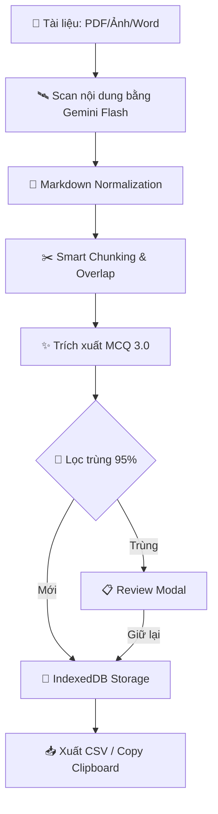

# 🧠 MCQ AnkiGen Pro — Từ Tài Liệu Đến Thẻ Anki Trong Vài Phút

> **Biến mọi tài liệu Y khoa (scan mờ, ảnh chụp vội, PDF nặng) thành bộ thẻ Anki chất lượng cao chỉ trong vài phút.**
> *Developed by [PonZ](https://github.com/tranhoait123)*

---

[ [🇻🇳 Tiếng Việt](README.md) | [🇺🇸 English](README.en.md) ]

## 📑 Mục Lục

1. [Giới thiệu](#giới-thiệu)
2. [Kiến Trúc Hệ Thống](#kiến-trúc-hệ-thống)
3. [Dùng Online — Không Cần Cài Đặt](#dùng-online)
4. [Video Hướng Dẫn & File Mẫu](#video-file-mau)
5. [Lấy Google Gemini API Key](#api-key)
6. [Hướng dẫn sử dụng chi tiết](#huong-dan)
7. [Deep Dive: Công Nghệ Trích Xuất 3.0](#extraction-3)
8. [Import CSV vào Anki](#import-anki)
9. [Cài đặt chạy trên máy (Tùy chọn)](#install-local)
10. [Công Nghệ Sử Dụng (Tech Stack)](#tech-stack)
11. [Bảo Mật & Quyền Riêng Tư](#security)
12. [Lộ Trình Phát Triển (Roadmap)](#roadmap)
13. [Đóng Góp (Contributing)](#contributing)
14. [Mẹo nâng cao & Xử lý lỗi](#tips)
15. [Câu hỏi thường gặp (FAQ)](#faq)
16. [Nhật Ký Cập Nhật](#changelog)
17. [Giấy Phép (License)](#license)

---

## <a id="giới-thiệu"></a> 🧠 Giới Thiệu

**MCQ AnkiGen Pro** là công cụ mã nguồn mở giúp bạn:

| Tính năng | Mô tả |
| :--- | :--- |
| 🤖 **Trích xuất MCQ 3.0** | Công cụ AI thế hệ mới, tự động sửa lỗi quét mờ, gối đầu trang và xử lý JSON cực kỳ ổn định |
| 🩺 **Giải thích như Giáo sư Y khoa** | Mỗi câu hỏi đều kèm: đáp án cốt lõi, phân tích sâu, bằng chứng y văn, cảnh báo lâm sàng |
| 💾 **Pro Storage (Safe)** | Dữ liệu được lưu an toàn với ID duy nhất — không lo mất dữ liệu khi reload hay lỗi trình duyệt |
| 🔄 **Lọc trùng Y khoa (95%)** | Thuật toán so sánh nội dung đạt độ chính xác 95%, nhận diện logic phủ định (KHÔNG/NGOẠI TRỪ) |
| 🌙 **Dark Mode & Split View** | Học đêm không mỏi mắt, đối chiếu tài liệu gốc và kết quả song song |

---

## <a id="kiến-trúc-hệ-thống"></a> 🏗️ Kiến Trúc Hệ Thống

Dữ liệu của bạn được xử lý qua quy trình khép kín đảm bảo tính toàn vẹn và độ chính xác:



---

## <a id="dùng-online"></a> ⚡ Dùng Online — Không Cần Cài Đặt

> **Đây là cách đơn giản nhất để bắt đầu** — chỉ cần trình duyệt và API Key!

### 👉 Truy cập ngay: [mcqankigen.drponz.com](https://mcqankigen.drponz.com/)

Ứng dụng đã được deploy online, bạn có thể sử dụng **ngay lập tức** trên mọi thiết bị (PC, Mac, điện thoại, tablet) mà **không cần cài đặt bất cứ thứ gì**.

### Chỉ cần 3 bước không dấu

```text
 ┌──────────────────────────────────────────────────────────────┐
 │                                                              │
 │   Bước 1 ─ Mở  https://mcqankigen.drponz.com/               │
 │   Bước 2 ─ Lấy API Key miễn phí (xem hướng dẫn bên dưới)   │
 │   Bước 3 ─ Tải file lên → Quét → Trích xuất → Xuất CSV!     │
 │                                                              │
 └──────────────────────────────────────────────────────────────┘
```

| Ưu điểm | Chi tiết |
| :--- | :--- |
| ✅ **Không cần cài đặt** | Mở link, dùng ngay |
| ✅ **Miễn phí 100%** | Chỉ cần API Key Google (miễn phí) |
| ✅ **Đầy đủ tính năng** | Dark Mode, Split View, chỉnh sửa, lọc, xuất CSV |
| ✅ **Mọi thiết bị** | PC, Mac, điện thoại, tablet — chỉ cần trình duyệt |
| ✅ **Dữ liệu an toàn** | Mọi xử lý diễn ra trên trình duyệt, không lưu trên server |
| ✅ **Luôn cập nhật** | Tự động có phiên bản mới nhất mỗi khi truy cập |

---

## <a id="video-file-mau"></a> 🎬 Video Hướng Dẫn & File Mẫu

### Video Demo

Xem video demo toàn bộ quy trình từ tải file → trích xuất → xuất CSV → import Anki:

<https://github.com/user-attachments/assets/huong-dan-su-dung.mov>

> 📹 File video có sẵn trong repo: [`Hướng dẫn sử dụng.mov`](./Hướng%20dẫn%20sử%20dụng.mov)

### 📦 File Mẫu — Xem Thành Quả Ngay

Muốn xem kết quả thực tế trước khi bắt đầu? Import file demo vào Anki để trải nghiệm:

| File | Mô tả | Tải |
| :--- | :--- | :--- |
| **DEMO.apkg** | 🎉 Bộ thẻ mẫu đã trích xuất sẵn — xem thành quả thực tế | [📥 Tải DEMO.apkg](./DEMO.apkg) |
| **3MCQ.apkg** | 📋 Note Type "3MCQ" tối ưu cho app — dùng khi import CSV | [📥 Tải 3MCQ.apkg](./3MCQ.apkg) |

---

## <a id="api-key"></a> 🔑 Lấy Google Gemini API Key (Miễn Phí)

API Key là "chìa khóa" để ứng dụng giao tiếp với AI của Google. Bạn được sử dụng **hoàn toàn miễn phí** trong giới hạn cá nhân.

### Các bước thực hiện không dấu

1. Truy cập [Google AI Studio](https://aistudio.google.com/app/apikey)
2. Đăng nhập bằng tài khoản Google của bạn
3. Nhấn nút **"Create API Key"** (Tạo API Key)
4. Chọn một dự án Google Cloud (hoặc để mặc định), rồi nhấn **"Create"**
5. Sao chép API Key hiển thị (dạng `AIzaSy...`) — lưu lại cẩn thận!

> ⚠️ **Bảo mật API Key:** Không chia sẻ Key cho người khác.

### 🔥 Mẹo: Tạo nhiều API Key từ nhiều Project để dùng FREE nhiều hơn

Mỗi API Key thuộc một **Google Cloud Project**, và mỗi Project có **quota miễn phí riêng biệt**. Bằng cách tạo nhiều Key từ nhiều Project khác nhau, bạn sẽ **nhân bội** lượng sử dụng miễn phí!

#### Cách tạo nhiều Key không dấu

1. Vào [Google AI Studio → API Keys](https://aistudio.google.com/app/apikey)
2. Nhấn **"Create API Key"**
3. Ở mục **"Google Cloud Project"**, nhấn **"Create new project"** (Tạo dự án mới) thay vì chọn project cũ
4. Đặt tên project (VD: `anki-key-2`, `anki-key-3`...) → Nhấn **"Create"**
5. Lặp lại Bước 1-4 để tạo thêm Key

#### Cách nhập nhiều Key vào ứng dụng không dấu

Vào **⚙️ Cài đặt → Google Gemini API Key**, dán tất cả Key cách nhau bằng **dấu phẩy** `,`:

```text
AIzaSyA...,AIzaSyB...,AIzaSyC...
```

---

## <a id="huon-dan"></a> 🌐 Hướng dẫn sử dụng chi tiết

> Các bước dưới đây áp dụng cho **cả bản online** lẫn bản cài trên máy. Giao diện hoàn toàn giống nhau.

### Bước 1: Cấu hình API Key & Model AI

1. Nhấn vào **biểu tượng ⚙️ (Cài đặt)** ở góc trên bên phải
2. Cửa sổ **"Cài đặt hệ thống"** sẽ hiện ra:

| Mục | Hướng dẫn |
| :--- | :--- |
| **Google Gemini API Key** | Dán API Key. *Có thể nhập nhiều key cách nhau bằng dấu phẩy để bypass giới hạn.* |
| **Mô hình AI (Model)** | **Khuyên dùng: `Gemini 3.1 Flash-Lite`** — nhanh và chính xác nhất. |
| **Vai trò AI** | Chọn vai trò chuyên biệt: **Y Khoa**, **Tiếng Anh**, **Luật**, **CNTT**. |

1. Nhấn **"Đã Xong"** để lưu.

### 🎭 Giải mã các Vai trò AI (AI Roles)

Việc chọn đúng vai trò giúp AI "kích hoạt" đúng vùng kiến thức chuyên biệt:

| Vai trò | Điểm đặc biệt |
| :--- | :--- |
| 🩺 **Y Khoa** | Tập trung vào triệu chứng, chẩn đoán, điều trị và bằng chứng y văn (Evidence-based). |
| 🔠 **Tiếng Anh** | Chú trọng ngữ pháp, từ vựng, ngữ cảnh sử dụng và ví dụ minh họa. |
| ⚖️ **Luật** | Trích dẫn chính xác điều luật, khoản, mục và phân tích tình huống pháp lý. |
| 💻 **CNTT** | Trích xuất code, giải thích thuật toán và kiến thức hệ thống. |

---

### Bước 2: Tải tài liệu lên

Ở phần **Control Panel** (bên trái màn hình):

1. **Kéo thả file** vào vùng tải lên, hoặc **nhấn vào vùng đó** để chọn file
2. Hệ thống hỗ trợ: 📄 **PDF** (tối đa 50MB/file), 🖼️ **Ảnh**, 📝 **Word**, 📋 **Text**.
3. Sau khi tải xong, mỗi file hiển thị trạng thái **"Đã sẵn sàng"**.

---

### Bước 3: Quét & Trích xuất câu hỏi

Quy trình gồm **2 giai đoạn** tuần tự:

#### Giai đoạn 1 — Quét tài liệu (Scan)

1. Nhấn nút **"🛰️ QUÉT TÀI LIỆU"**
2. AI sẽ phân tích tài liệu và cho biết chủ đề cùng số câu hỏi ước tính.
3. Khi hiện **"Hệ thống đã sẵn sàng"** → Chuyển sang giai đoạn 2.

#### Giai đoạn 2 — Trích xuất câu hỏi (Extract)

1. Nhấn nút **"✨ TRÍCH XUẤT CÂU HỎI"**
2. Hệ thống sẽ tự động cắt PDF, quét song song và tự lọc trùng lặp.
3. **Thanh tiến trình** hiển thị real-time số câu đã trích xuất.

---

### Bước 4: Xem, chỉnh sửa & lọc kết quả

Kết quả hiển thị ở **panel bên phải**:

#### 🔍 Thanh công cụ

| Nút | Chức năng |
| :--- | :--- |
| **🔎 Tìm kiếm** | Gõ từ khóa để lọc câu hỏi |
| **📊 Lọc độ khó** | Lọc theo Easy / Medium / Hard |
| **✏️ Soạn thảo / 👁️ Review** | Chuyển giữa chế độ chỉnh sửa và xem trước giao diện Anki |

#### ✏️ Chỉnh sửa câu hỏi

- Hover lên bất kỳ câu hỏi nào → hiện nút: **🖊 Sửa** và **🗑 Xóa**.
- Khi chỉnh sửa:
  - Nhấn **"Lưu thay đổi"** hoặc `Ctrl+Enter` để lưu
  - Nhấn **"Hủy bỏ"** hoặc `Escape` để hủy

#### 🔀 Chế độ Split View (So sánh)

Nhấn nút **📊 (Columns)** ở Header để bật **Split View**:
- **Bên trái**: Hiển thị tài liệu gốc (PDF/Ảnh)
- **Bên phải**: Hiển thị câu hỏi đã trích xuất

---

### Bước 5: Xuất file CSV

Khi đã hài lòng với kết quả:

| Nút | Chức năng |
| :--- | :--- |
| **📋 Copy CSV** | Copy nội dung CSV vào clipboard |
| **📥 Xuất CSV Anki** | Tải file `.csv` về máy, sẵn sàng import vào Anki |

---

## <a id="extraction-3"></a> 🧠 Deep Dive: Công Nghệ Trích Xuất 3.0

Phiên bản **Ultima (v5.2)** tập trung vào độ tin cậy tuyệt đối cho dữ liệu Y khoa:

### 🔬 Thuật toán so sánh vân tay (Fingerprinting)

Thay vì so sánh toàn bộ văn bản, hệ thống tạo ra một "vân tay" của câu hỏi sau khi đã:
- Loại bỏ số thứ tự (Câu 1, Question 2...)
- Chuẩn hóa khoảng trắng và viết hoa.
- Sử dụng khoảng cách **Levenshtein** để tính độ tương đồng.
- **Ngưỡng 95%**: Đảm bảo chỉ những câu thực sự trùng mới bị gom nhóm.

### 🛡️ Cơ chế "Pháp y tài liệu"

AI không chỉ trích xuất, nó còn **khôi phục** dữ liệu:
- Tự nối lại các câu hỏi bị ngắt quãng giữa hai trang PDF.
- Sửa lỗi sai chính tả do OCR thông minh.
- Định dạng lại bảng biểu vào cột `Explanation` dưới dạng Markdown table chuẩn.

---

## <a id="import-anki"></a> 📲 Import CSV Vào Anki

### Bước 1: Mở Anki Desktop

Tải Anki tại <https://apps.ankiweb.net/>.

### Bước 2: Chọn Note Type

#### ⚡ Cách nhanh: Dùng Note Type "3MCQ" có sẵn

1. [📥 Tải file 3MCQ.apkg](./3MCQ.apkg)
2. Mở Anki → **File → Import** → chọn file vừa tải
3. Note Type "3MCQ" sẽ tự động được thêm vào Anki.

#### 🔧 Cách thủ công: Tự tạo Note Type

Vào **Tools → Manage Note Types → Add**, tạo Note Type với các trường tương ứng trong CSV.

---

## <a id="install-local"></a> 💻 Cài Đặt Chạy Trên Máy (Tùy Chọn)

#### 1. Tải mã nguồn

```bash
git clone https://github.com/tranhoait123/anki-mcq-export.git
cd anki-mcq-export
```

#### 2. Cài thư viện (chỉ chạy lần đầu)

```bash
npm install
```

#### 3. Khởi chạy

```bash
npm run dev
```

---

## <a id="tech-stack"></a> 🛠️ Công Nghệ Sử Dụng (Tech Stack)

- **Frontend**: React 18, Vite ⚡
- **State Management**: Zustand 📦
- **Styling**: Tailwind CSS (Glassmorphism Effects)
- **Notifications**: Sonner (Apple Standard Toasts)
- **Storage**: IndexedDB (Pro Local Persistence)
- **AI Engine**: Google Generative AI v1.2 (Gemini SDK)

---

## <a id="security"></a> 🛡️ Bảo Mật & Quyền Riêng Tư

Chúng tôi coi trọng dữ liệu của bạn hơn bất cứ điều gì:
1. **Local-First**: Mọi xử lý file diễn ra ngay trên trình duyệt của bạn.
2. **Zero Server**: Không có server trung gian nào lưu trữ API Key hay tài liệu của bạn.
3. **API Direct**: Ứng dụng kết nối trực tiếp đến máy chủ Google Gemini.

---

## <a id="benefits"></a> 🩺 Tại sao Sinh viên Y khoa cần AnkiGen Pro?

Việc học Y khoa đòi hỏi khối lượng kiến thức khổng lồ. **AnkiGen Pro** được thiết kế để giải quyết 3 nỗi đau lớn nhất:
- **Tiết kiệm thời gian**: Biến 100 trang PDF bài giảng thành bộ thẻ Anki trong 5 phút, thay vì 5 ngày ngồi gõ tay.
- **Giải thích chuyên sâu**: AI không chỉ đưa đáp án, nó cung cấp cơ chế bệnh sinh và lý luận lâm sàng đi kèm, giúp bạn học 1 được 10.
- **Độ chính xác Y khoa**: Với thuật toán **Extraction 3.0**, chúng tôi đảm bảo các câu hỏi phủ định (NGOẠI TRỪ) hay các ca lâm sàng phức tạp được trích xuất nguyên vẹn.

---

## <a id="roadmap"></a> 🚀 Lộ Trình Phát Triển (Roadmap)

- [x] **v5.2**: Medical Extraction 3.0 & IndexedDB Storage.
- [ ] **v5.5**: Hỗ trợ xuất trực tiếp file `.apkg` (không cần qua CSV).
- [ ] **v6.0**: Tích hợp tra cứu y văn trực tiếp từ PubMed/UpToDate khi giải thích câu hỏi.
- [ ] **v6.5**: Ứng dụng Mobile Native (iOS/Android).

---

## <a id="contributing"></a> 🤝 Đóng Góp (Contributing)

Mọi đóng góp (Pull Request, Issue) đều được chào đón! Hãy cùng xây dựng công cụ này hoàn thiện hơn cho cộng đồng học thuật.

---

## <a id="tips"></a> 🎯 Mẹo nâng cao & Xử lý lỗi

### ❌ Lỗi thường gặp

| Lỗi | Nguyên nhân | Giải pháp |
| :--- | :--- | :--- |
| **API 429** | Vượt giới hạn miễn phí | Nhập thêm nhiều Key, cách nhau bằng dấu phẩy |
| **Ít câu hỏi** | Tài liệu mờ / PDF mã hóa | Chụp ảnh rõ hơn hoặc convert lại PDF |
| **Empty response** | API không phản hồi | Thử lại sau vài giây hoặc đổi sang Model khác |

### 💡 Mẹo tối ưu

1. **Nhiều Key = Xoay vòng nhanh hơn**: Tạo 3-5 API Key để trích xuất mượt mà nhất.
2. **Overlap Scanning**: Hệ thống tự gối đầu 3 trang mỗi lần quét để không sót câu hỏi giữa trang.
3. **PWA**: Nhấn "Tải App" để cài ứng dụng về máy như phần mềm chuyên nghiệp.

---

## <a id="faq"></a> ❓ Câu hỏi thường gặp (FAQ)

- **Ứng dụng có miễn phí không?** Có, 100% mã nguồn mở.
- **Dữ liệu của tôi đi đâu?** Trực tiếp từ trình duyệt đến máy chủ Google.
- **Nhiều file cùng lúc được không?** Được, hệ thống hỗ trợ tải và quét hàng loạt.

---

## <a id="changelog"></a> 📜 Nhật Ký Cập Nhật

| Phiên bản | Ngày | Mô tả |
| :--- | :--- | :--- |
| **v5.2 (Ultima)** | 07/04/2026 | **Medical Extraction 3.0: 95% Content Precision, Robust DB Storage, Duplicate Review UI** |
| **v5.1 (Robust)** | 04/04/2026 | Robust MCQ Normalization, Logic so sánh đáp án chính xác 100% |
| **v5.0 (Atomic)** | 04/04/2026 | Zustand Architecture, Sonner Toasts, Review-First Mode |
| **v4.7 (Gemini)** | 28/03/2026 | Khuyên dùng Gemini 3.1 Flash-Lite, hỗ trợ API Rotation |
| **v4.0 (Pro)** | 04/02/2026 | Giới hạn 50MB, Lưu trữ vĩnh viễn (IndexedDB) |
| **v3.0** | 02/02/2026 | Phát hiện câu hỏi trùng lặp thông minh |

---

## <a id="license"></a> 💳 Giấy Phép (License)

Dự án được phát hành dưới giấy phép **MIT**.

---

**Phát triển bởi [PonZ](https://github.com/tranhoait123)** 🩺
