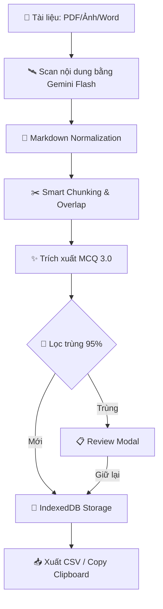

# 🧠 MCQ AnkiGen Pro — Từ Tài Liệu Đến Thẻ Anki Trong Vài Phút

> **Biến mọi tài liệu Y khoa (scan mờ, ảnh chụp vội, PDF nặng) thành bộ thẻ Anki chất lượng cao chỉ trong vài phút.**
> *Developed by [PonZ](https://github.com/tranhoait123)*

---

[ [🇻🇳 Tiếng Việt](README.md) | [🇺🇸 English](README.en.md) ]

## 📑 Mục Lục

1. [Giới thiệu](#-giới-thiệu)
2. [🏗️ Kiến Trúc Hệ Thống](#️-kiến-trúc-hệ-thống)
3. [⚡ Dùng Online — Không Cần Cài Đặt](#-dùng-online--không-cần-cài-đặt)
4. [🎬 Video Hướng Dẫn & File Mẫu](#-video-hướng-dẫn--file-mẫu)
5. [🔑 Lấy Google Gemini API Key (Miễn phí)](#-lấy-google-gemini-api-key-miễn-phí)
6. [🌐 Hướng dẫn sử dụng chi tiết](#-hướng-dẫn-sử-dụng-chi-tiết)
7. [🧠 Deep Dive: Công Nghệ Trích Xuất 3.0](#-deep-dive-công-nghệ-trích-xuất-30)
8. [📲 Import CSV vào Anki](#-import-csv-vào-anki)
9. [💻 Cài đặt chạy trên máy (Tùy chọn)](#-cài-đặt-chạy-trên-máy-tùy-chọn)
10. [🛠️ Công Nghệ Sử Dụng (Tech Stack)](#️-công-nghệ-sử-dụng-tech-stack)
11. [🛡️ Bảo Mật & Quyền Riêng Tư](#️-bảo-mật--quyền-riêng-tư)
12. [🚀 Lộ Trình Phát Triển (Roadmap)](#-lộ-trình-phát-triển-roadmap)
13. [🤝 Đóng Góp (Contributing)](#-đóng-góp-contributing)
14. [🎯 Mẹo nâng cao & Xử lý lỗi](#-mẹo-nâng-cao--xử-lý-lỗi)
15. [❓ Câu hỏi thường gặp (FAQ)](#-câu-hỏi-thường-gặp-faq)
16. [📜 Nhật Ký Cập Nhật](#-nhật-ký-cập-nhật)
17. [💳 Giấy Phép (License)](#-giấy-phép-license)

---

## 🧠 Giới Thiệu

**MCQ AnkiGen Pro** là công cụ mã nguồn mở giúp bạn:

| Tính năng | Mô tả |
|:---|:---|
| 🤖 **Trích xuất MCQ 3.0** | Công cụ AI thế hệ mới, tự động sửa lỗi quét mờ, gối đầu trang và xử lý JSON cực kỳ ổn định |
| 🩺 **Giải thích như Giáo sư Y khoa** | Mỗi câu hỏi đều kèm: đáp án cốt lõi, phân tích sâu, bằng chứng y văn, cảnh báo lâm sàng |
| 💾 **Pro Storage (Safe)** | Dữ liệu được lưu an toàn với ID duy nhất — không lo mất dữ liệu khi reload hay lỗi trình duyệt |
| 🔄 **Lọc trùng Y khoa (95%)** | Thuật toán so sánh nội dung đạt độ chính xác 95%, nhận diện logic phủ định (KHÔNG/NGOẠI TRỪ) |
| 🌙 **Dark Mode & Split View** | Học đêm không mỏi mắt, đối chiếu tài liệu gốc và kết quả song song |

---

## 🏗️ Kiến Trúc Hệ Thống

Dữ liệu của bạn được xử lý qua quy trình khép kín đảm bảo tính toàn vẹn và độ chính xác:



---

## ⚡ Dùng Online — Không Cần Cài Đặt

> **Đây là cách đơn giản nhất để bắt đầu** — chỉ cần trình duyệt và API Key!

### 👉 Truy cập ngay: [mcqankigen.drponz.com](https://mcqankigen.drponz.com/)

Ứng dụng đã được deploy online, bạn có thể sử dụng **ngay lập tức** trên mọi thiết bị (PC, Mac, điện thoại, tablet) mà **không cần cài đặt bất cứ thứ gì**.

### Chỉ cần 3 bước:

```
 ┌──────────────────────────────────────────────────────────────┐
 │                                                              │
 │   Bước 1 ─ Mở  https://mcqankigen.drponz.com/               │
 │   Bước 2 ─ Lấy API Key miễn phí (xem hướng dẫn bên dưới)   │
 │   Bước 3 ─ Tải file lên → Quét → Trích xuất → Xuất CSV!     │
 │                                                              │
 └──────────────────────────────────────────────────────────────┘
```

| Ưu điểm | Chi tiết |
|:---|:---|
| ✅ **Không cần cài đặt** | Mở link, dùng ngay |
| ✅ **Miễn phí 100%** | Chỉ cần API Key Google (miễn phí) |
| ✅ **Đầy đủ tính năng** | Dark Mode, Split View, chỉnh sửa, lọc, xuất CSV |
| ✅ **Mọi thiết bị** | PC, Mac, điện thoại, tablet — chỉ cần trình duyệt |
| ✅ **Dữ liệu an toàn** | Mọi xử lý diễn ra trên trình duyệt, không lưu trên server |
| ✅ **Luôn cập nhật** | Tự động có phiên bản mới nhất mỗi khi truy cập |

> 💡 **Trên điện thoại:** Bạn có thể thêm trang web vào màn hình chính (Add to Home Screen) để sử dụng như một ứng dụng native!

---

## 🎬 Video Hướng Dẫn & File Mẫu

### Video Demo

Xem video demo toàn bộ quy trình từ tải file → trích xuất → xuất CSV → import Anki:

https://github.com/user-attachments/assets/huong-dan-su-dung.mov

> 📹 File video có sẵn trong repo: [`Hướng dẫn sử dụng.mov`](./Hướng%20dẫn%20sử%20dụng.mov)

### 📦 File Mẫu — Xem Thành Quả Ngay

Muốn xem kết quả thực tế trước khi bắt đầu? Import file demo vào Anki để trải nghiệm:

| File | Mô tả | Tải |
|:---|:---|:---|
| **DEMO.apkg** | 🎉 Bộ thẻ mẫu đã trích xuất sẵn — xem thành quả thực tế | [📥 Tải DEMO.apkg](./DEMO.apkg) |
| **3MCQ.apkg** | 📋 Note Type "3MCQ" tối ưu cho app — dùng khi import CSV | [📥 Tải 3MCQ.apkg](./3MCQ.apkg) |

> 💡 Mở Anki → **File → Import** → chọn file `DEMO.apkg` để xem ngay bộ thẻ trắc nghiệm mẫu với đầy đủ câu hỏi, đáp án và giải thích chi tiết!

---

## 🔑 Lấy Google Gemini API Key (Miễn Phí)

API Key là "chìa khóa" để ứng dụng giao tiếp với AI của Google. Bạn được sử dụng **hoàn toàn miễn phí** trong giới hạn cá nhân.

### Các bước thực hiện:

**Bước 1:** Truy cập [Google AI Studio](https://aistudio.google.com/app/apikey)

**Bước 2:** Đăng nhập bằng tài khoản Google của bạn

**Bước 3:** Nhấn nút **"Create API Key"** (Tạo API Key)

**Bước 4:** Chọn một dự án Google Cloud (hoặc để mặc định), rồi nhấn **"Create"**

**Bước 5:** Sao chép API Key hiển thị (dạng `AIzaSy...`) — lưu lại cẩn thận!

> ⚠️ **Bảo mật API Key:** Không chia sẻ Key cho người khác.

### 🔥 Mẹo: Tạo nhiều API Key từ nhiều Project để dùng FREE nhiều hơn

Mỗi API Key thuộc một **Google Cloud Project**, và mỗi Project có **quota miễn phí riêng biệt**. Bằng cách tạo nhiều Key từ nhiều Project khác nhau, bạn sẽ **nhân bội** lượng sử dụng miễn phí!

#### Cách tạo nhiều Key:

**Bước 1:** Vào [Google AI Studio → API Keys](https://aistudio.google.com/app/apikey)

**Bước 2:** Nhấn **"Create API Key"**

**Bước 3:** Ở mục **"Google Cloud Project"**, nhấn **"Create new project"** (Tạo dự án mới) thay vì chọn project cũ

**Bước 4:** Đặt tên project (VD: `anki-key-2`, `anki-key-3`...) → Nhấn **"Create"**

**Bước 5:** Lặp lại Bước 2-4 để tạo thêm Key từ các Project khác nhau

> 💡 **Mỗi Project = 1 quota miễn phí riêng.** Ví dụ:
> - Project 1 → Key `AIzaSyA...` (quota riêng)
> - Project 2 → Key `AIzaSyB...` (quota riêng)
> - Project 3 → Key `AIzaSyC...` (quota riêng)
>
> **3 Project = gấp 3 lần quota miễn phí!** Bạn có thể tạo thoải mái nhiều Project.

#### Cách nhập nhiều Key vào ứng dụng:

Vào **⚙️ Cài đặt → Google Gemini API Key**, dán tất cả Key cách nhau bằng **dấu phẩy** `,`:

```
AIzaSyA...,AIzaSyB...,AIzaSyC...
```

Hệ thống sẽ **tự động xoay vòng** — khi Key nào hết quota (lỗi 429), nó sẽ chuyển sang Key tiếp theo mà bạn không cần làm gì cả!

---

## 🌐 Hướng Dẫn Sử Dụng Chi Tiết

> Các bước dưới đây áp dụng cho **cả bản online** ([mcqankigen.drponz.com](https://mcqankigen.drponz.com/)) **lẫn bản cài trên máy**. Giao diện hoàn toàn giống nhau.

### Bước 1: Cấu hình API Key & Model AI

1. Nhấn vào **biểu tượng ⚙️ (Cài đặt)** ở góc trên bên phải
2. Cửa sổ **"Cài đặt hệ thống"** sẽ hiện ra:

| Mục | Hướng dẫn |
|:---|:---|
| **Google Gemini API Key** | Dán API Key bạn đã lấy ở bước trên. *Có thể nhập nhiều key cách nhau bằng dấu phẩy để bypass giới hạn miễn phí.* |
| **Mô hình AI (Model)** | Chọn model phù hợp. **Khuyên dùng: `Gemini 3.1 Flash-Lite`** — nhanh và chính xác nhất. |
| **Vai trò AI** | Chọn vai trò cho AI theo môn học: **Y Khoa**, **Tiếng Anh**, **Luật**, **CNTT** — hoặc tự viết vai trò riêng. |

3. Nhấn **"Đã Xong"** để lưu.

3. Nhấn **"Đã Xong"** để lưu.

### 🎭 Giải mã các Vai trò AI (AI Roles)

Việc chọn đúng vai trò giúp AI "kích hoạt" đúng vùng kiến thức chuyên biệt:

| Vai trò | Điểm đặc biệt |
|:---|:---|
| 🩺 **Y Khoa** | Tập trung vào triệu chứng, chẩn đoán, điều trị và bằng chứng y văn (Evidence-based). |
| 🔠 **Tiếng Anh** | Chú trọng ngữ pháp, từ vựng, ngữ cảnh sử dụng và ví dụ minh họa. |
| ⚖️ **Luật** | Trích dẫn chính xác điều luật, khoản, mục và phân tích tình huống pháp lý. |
| 💻 **CNTT** | Trích xuất code, giải thích thuật toán và kiến thức hệ thống. |

> 💡 **Mẹo chọn Model:**
> *   **Gemini 3.1 Flash-Lite** — Nhanh nhất, phù hợp phần lớn trường hợp *(khuyên dùng)*
> *   **Gemini 3 Pro** — Tư duy Y khoa sâu nhất, nhưng chậm hơn
> *   **Gemini 2.5 Flash** — Dự phòng ổn định nếu các model mới bị lỗi

---

### Bước 2: Tải tài liệu lên

Ở phần **Control Panel** (bên trái màn hình):

1. **Kéo thả file** vào vùng tải lên, hoặc **nhấn vào vùng đó** để chọn file
2. Hệ thống hỗ trợ các định dạng:
   - 📄 **PDF** (tối đa 50MB/file)
   - 🖼️ **Ảnh** (PNG, JPG, JPEG, WebP, HEIC)
   - 📝 **Word** (DOCX)
   - 📋 **Text** (TXT, MD)
3. Có thể tải **nhiều file cùng lúc**
4. Sau khi tải xong, mỗi file hiển thị trạng thái **"Đã sẵn sàng"**

> ⚠️ **Với file scan/ảnh chụp đề thi**: Để đạt kết quả tốt nhất, hãy:
> - Chụp **thẳng góc**, đủ sáng, không bị mờ
> - Tránh để **ngón tay che chữ**
> - Nếu chữ viết tay đè nhiều, AI sẽ cố "nhìn xuyên qua" nhưng độ chính xác có thể giảm

---

### Bước 3: Quét & Trích xuất câu hỏi

Quy trình gồm **2 giai đoạn** tuần tự:

#### Giai đoạn 1 — Quét tài liệu (Scan)

1. Nhấn nút **"🛰️ QUÉT TÀI LIỆU"**
2. AI sẽ phân tích tài liệu và cho biết:
   - **Chủ đề** (VD: "Nhi khoa - Bệnh lý hô hấp")
   - **Số câu hỏi ước tính** (VD: 45 câu)
3. Khi hiện **"Hệ thống đã sẵn sàng"** → Chuyển sang giai đoạn 2

#### Giai đoạn 2 — Trích xuất câu hỏi (Extract)

1. Nhấn nút **"✨ TRÍCH XUẤT CÂU HỎI"**
2. Hệ thống sẽ:
   - Cắt PDF thành từng phần nhỏ (3 trang/phần, có gối đầu)
   - Quét song song (2 luồng cùng lúc) cho tốc độ nhanh nhất
   - Tự lọc trùng lặp
3. **Thanh tiến trình** hiển thị real-time số câu đã trích xuất

> 📝 Nếu số câu trích xuất **thấp hơn 80%** so với ước tính, hệ thống sẽ tự động chạy **Kiểm toán (Audit)** để phân tích lý do thiếu và đưa ra lời khuyên.

---

### Bước 4: Xem, chỉnh sửa & lọc kết quả

Sau khi trích xuất xong, kết quả hiển thị ở **panel bên phải**:

#### 🔍 Thanh công cụ

| Nút | Chức năng |
|:---|:---|
| **🔎 Tìm kiếm** | Gõ từ khóa để lọc câu hỏi |
| **📊 Lọc độ khó** | Lọc theo Easy / Medium / Hard |
| **✏️ Soạn thảo / 👁️ Review** | Chuyển giữa chế độ chỉnh sửa và xem trước giao diện Anki |
| **⚠️ Lọc Cảnh Báo** | Chỉ hiện câu hỏi có cảnh báo lâm sàng |

#### ✏️ Chỉnh sửa câu hỏi

- Hover lên bất kỳ câu hỏi nào → hiện 2 nút:
  - **🖊 Sửa** — Chỉnh sửa câu hỏi, đáp án, giải thích
  - **🗑 Xóa** — Xóa câu hỏi khỏi danh sách
- Khi chỉnh sửa:
  - Nhấn **"Lưu thay đổi"** hoặc `Ctrl+Enter` để lưu
  - Nhấn **"Hủy bỏ"** hoặc `Escape` để hủy

#### 🔀 Chế độ Split View (So sánh)

Nhấn nút **📊 (Columns)** ở Header để bật **Split View**:
- **Bên trái**: Hiển thị tài liệu gốc (PDF/Ảnh)
- **Bên phải**: Hiển thị câu hỏi đã trích xuất
- Giúp bạn **đối chiếu** xem AI có trích xuất đúng không

---

### Bước 5: Xuất file CSV

Khi đã hài lòng với kết quả:

| Nút | Chức năng |
|:---|:---|
| **📋 Copy CSV** | Copy toàn bộ nội dung CSV vào clipboard — paste trực tiếp vào Excel/Google Sheets |
| **📥 Xuất CSV Anki** | Tải file `.csv` về máy, sẵn sàng import vào Anki |

File CSV có các cột:
```
Question | A | B | C | D | E | CorrectAnswer | ExplanationHTML | Source | Difficulty
```

> File CSV đã được format chuẩn **UTF-8 BOM** để đảm bảo hiển thị tiếng Việt đúng trên mọi phần mềm.

---

### 🌙 Các tính năng bổ sung

| **Dark Mode** | Nhấn icon ☀️/🌙 ở Header để chuyển đổi |
| **Lưu trữ Pro (Safe)** | Dữ liệu được gán ID duy nhất và lưu trong IndexedDB — tuyệt đối không mất dữ liệu |
| **Trung tâm Trùng lặp** | Giao diện Review chuyên nghiệp để đối chiếu và quyết định Giữ lại/Bỏ qua/Ghi đè câu hỏi trùng |
| **Cài đặt PWA** | Nếu trình duyệt hỗ trợ, nút **"📲 Tải App"** xuất hiện — cài app về máy như ứng dụng native |
| **Xoay tua API Key** | Tự động đổi Key khi gặp lỗi 429 để quá trình trích xuất không bị gián đoạn |

---

## 🧠 Deep Dive: Công Nghệ Trích Xuất 3.0

Phiên bản **Ultima (v5.2)** tập trung vào độ tin cậy tuyệt đối cho dữ liệu Y khoa:

### 🔬 Thuật toán so sánh vân tay (Fingerprinting)
Thay vì so sánh toàn bộ văn bản, hệ thống tạo ra một "vân tay" của câu hỏi sau khi đã:
*   Loại bỏ số thứ tự (Câu 1, Question 2...)
*   Chuẩn hóa khoảng trắng và viết hoa.
*   Sử dụng khoảng cách **Levenshtein** để tính độ tương đồng.
*   **Ngưỡng 95%**: Đảm bảo chỉ những câu thực sự trùng mới bị gom nhóm, tránh mất các ca lâm sàng có bối cảnh gần giống nhau nhưng câu hỏi khác nhau.

### 🛡️ Cơ chế "Pháp y tài liệu"
AI không chỉ trích xuất, nó còn **khôi phục** dữ liệu:
*   Tự nối lại các câu hỏi bị ngắt quãng giữa hai trang PDF.
*   Sửa lỗi sai chính tả do OCR (Bệnh viện ➡️ Bệnh viện).
*   Định dạng lại bảng biểu vào cột `Explanation` dưới dạng Markdown table chuẩn.

---

## 📲 Import CSV Vào Anki

### Bước 1: Mở Anki Desktop

Tải Anki tại [apps.ankiweb.net](https://apps.ankiweb.net/) nếu chưa có.

### Bước 2: Chọn Note Type

#### ⚡ Cách nhanh: Dùng Note Type "3MCQ" có sẵn (Khuyên dùng)

Mình đã tạo sẵn Note Type **"3MCQ"** được tối ưu riêng cho ứng dụng này. Bạn chỉ cần:

1. 📥 Tải file [**3MCQ.apkg**](./3MCQ.apkg) (có sẵn trong repo)
2. Mở Anki → **File → Import** → chọn file `3MCQ.apkg` vừa tải
3. Note Type "3MCQ" sẽ tự động được thêm vào Anki — **xong, không cần làm gì thêm!**

> 💡 Note Type "3MCQ" đã được thiết kế sẵn template hiển thị đẹp với màu sắc, font chữ và bố cục tối ưu cho câu hỏi trắc nghiệm. Chỉ cần import là dùng ngay!
>
> 🎉 Muốn xem thành quả mẫu? Import file [**DEMO.apkg**](./DEMO.apkg) để xem bộ thẻ đã trích xuất sẵn với đầy đủ câu hỏi + giải thích chi tiết.

#### 🔧 Cách thủ công: Tự tạo Note Type

Nếu bạn muốn tự tạo, thực hiện như sau:

1. Vào **Tools → Manage Note Types → Add**
2. Tạo Note Type mới (VD: "MCQ Y Khoa") với các trường:
   - `Question`
   - `A`, `B`, `C`, `D`, `E`
   - `CorrectAnswer`
   - `ExplanationHTML`
   - `Source`
   - `Difficulty`

### Bước 3: Import CSV

1. Vào **File → Import**
2. Chọn file CSV đã xuất
3. Cấu hình:
   - **Type**: Chọn Note Type "3MCQ" (hoặc Note Type bạn tự tạo)
   - **Deck**: Chọn hoặc tạo bộ thẻ mới
   - **Field separator**: Comma
   - **Allow HTML in fields**: ✅ **BẬT** (quan trọng — để hiển thị giải thích đẹp)
4. Map các cột vào đúng trường
5. Nhấn **Import**

> 💡 Trường `ExplanationHTML` chứa HTML được format sẵn với màu sắc đẹp mắt. Hãy đặt nó trong phần **Back** (mặt sau) của thẻ Anki.

---

## 💻 Cài Đặt Chạy Trên Máy (Tùy Chọn)

> 📝 Phần này **chỉ dành cho bạn nào muốn chạy offline** trên máy tính cá nhân. Nếu bạn đang dùng bản online tại [mcqankigen.drponz.com](https://mcqankigen.drponz.com/), **bỏ qua phần này.**

### Yêu cầu hệ thống

| Thành phần | Yêu cầu |
|:---|:---|
| **Node.js** | v18 trở lên — [Tải tại đây](https://nodejs.org/) |
| **Git** *(tùy chọn)* | Để clone mã nguồn |

### Các bước cài đặt

**1. Tải mã nguồn:**

```bash
git clone https://github.com/tranhoait123/anki-mcq-export.git
cd anki-mcq-export
```

> 💡 Không quen Git? Vào trang [GitHub](https://github.com/tranhoait123/anki-mcq-export), nhấn **Code → Download ZIP**, rồi giải nén.

**2. Cài thư viện (chỉ chạy lần đầu):**

```bash
npm install
```

**3. Khởi chạy:**

```bash
npm run dev
```

Mở trình duyệt → truy cập **http://localhost:5173** → Sử dụng giống hệt bản online!

---

## 🛠️ Công Nghệ Sử Dụng (Tech Stack)

*   **Frontend**: React 18, Vite (Siêu nhanh ⚡)
*   **State Management**: Zustand (Cực nhẹ & Ổn định)
*   **Styling**: Tailwind CSS với hiệu ứng Glassmorphism
*   **Icons**: Lucide React
*   **Notifications**: Sonner (Toast chuẩn Apple 🍎)
*   **Storage**: IndexedDB (Local persistence)
*   **AI Engine**: Google Generative AI v1.2 (Gemini SDK)
*   **PDF Core**: PDF.js (Mozilla)

---

## 🛡️ Bảo Mật & Quyền Riêng Tư

Chúng tôi coi trọng dữ liệu của bạn hơn bất cứ điều gì:
1.  **Local-First**: Mọi xử lý file, lưu trữ database diễn ra ngay trên trình duyệt của bạn.
2.  **Zero Server**: Không có server trung gian nào lưu trữ API Key hay tài liệu của bạn.
3.  **API Direct**: Ứng dụng kết nối trực tiếp từ máy của bạn đến máy chủ Google Gemini.

---

## 🐍 Phiên Bản Streamlit (Python)

Phiên bản đơn giản hơn, phù hợp nếu bạn muốn nhanh gọn.

```bash
# Cài đặt
pip install -r requirements.txt

# Chạy
streamlit run streamlit_app.py
```

Trình duyệt sẽ tự mở tại **http://localhost:8501**

1. **Sidebar:** Nhập **Gemini API Key** + Chọn **Model**
2. **Control Center:** Tải file lên → Nhấn **"🚀 BẮT ĐẦU TRÍCH XUẤT"**
3. **Kết quả:** Xem câu hỏi + Nhấn **"💾 TẢI XUỐNG CSV ANKI"**

---

## 🎯 Mẹo Nâng Cao & Xử Lý Lỗi

### ❌ Lỗi thường gặp

| Lỗi | Nguyên nhân | Giải pháp |
|:---|:---|:---|
| **"Vui lòng nhập API Key"** | Chưa nhập Key | Vào ⚙️ Cài đặt → Dán API Key |
| **Lỗi 429 (Quota exceeded)** | Vượt giới hạn miễn phí | Nhập thêm Key từ Project mới, cách nhau bằng dấu phẩy |
| **Số câu trích xuất ít** | Tài liệu mờ / viết tay nhiều | Chụp lại rõ hơn; thử model `Gemini 3 Pro` |
| **Kết quả rỗng** | File bị hỏng hoặc mã hóa | Thử convert sang PDF mới, hoặc chụp ảnh lại |
| **Lỗi "Empty response"** | API không phản hồi | Thử lại sau vài giây, hoặc đổi sang Key/Model khác |

### 💡 Mẹo tối ưu

1. **Nhiều Key = Xoay vòng nhanh hơn** — Tạo 3-5 API Key từ các Project khác nhau, hệ thống tự xoay vòng
2. **PDF lớn? Không sao!** — Hệ thống tự cắt PDF thành từng phần nhỏ (3 trang) với **kỹ thuật gối đầu** (overlap)
3. **Chỉnh sửa Vai trò AI** — Đang ôn Nhi khoa? Thêm dòng: *"Tập trung vào bệnh lý Nhi khoa"*
4. **Chế độ Review** — Xem trước giao diện Anki thực tế trước khi xuất CSV
5. **IndexedDB** — Tất cả câu hỏi lưu trên trình duyệt, reload không mất dữ liệu

---

## ❓ Câu Hỏi Thường Gặp (FAQ)

### 🗨️ "Ứng dụng có miễn phí không?"
**Có, hoàn toàn miễn phí.** Mã nguồn mở trên GitHub. Bạn chỉ cần tạo Google Gemini API Key (miễn phí).

### 🗨️ "Dữ liệu của tôi có bị gửi đi đâu không?"
Tài liệu của bạn được gửi đến **Google Gemini API** để xử lý. Ứng dụng **không lưu trữ dữ liệu trên server** — mọi thứ xử lý trên trình duyệt của bạn.

### 🗨️ "File scan quá mờ, AI có đọc được không?"
AI được huấn luyện với vai trò **"Chuyên gia Pháp y Tài liệu"** — đọc xuyên chữ viết tay, sửa lỗi OCR thông minh, khôi phục câu hỏi bị ngắt trang. Nếu file **quá mờ (>70% bị che)**, AI sẽ bỏ qua câu đó thay vì bịa.

### 🗨️ "Tôi có thể dùng cho môn khác ngoài Y khoa không?"
**Có!** Trong phần Cài đặt, chọn vai trò: Y Khoa | Tiếng Anh | Luật | CNTT — hoặc tự viết vai trò tùy chỉnh.

### 🗨️ "Sự khác biệt giữa 3 phiên bản?"

| Tính năng | ⚡ Online (Khuyên dùng) | 💻 Cài trên máy (Node.js) | 🐍 Streamlit (Python) |
|:---|:---|:---|:---|
| **Truy cập** | [mcqankigen.drponz.com](https://mcqankigen.drponz.com/) | `localhost:5173` | `localhost:8501` |
| **Yêu cầu** | ❌ Không cần cài gì | Cần Node.js + npm | Cần Python + pip |
| **Giao diện** | Cao cấp, Dark Mode | Giống hệt bản online | Cơ bản |
| **Lưu trữ** | IndexedDB (Bền vững) | IndexedDB (Bền vững) | Mất khi load lại |
| **Lọc trùng** | ✅ Có (95%) | ✅ Có (95%) | ❌ Không |
| **Tính riêng tư** | Local-first (An toàn) | Local-only (Tối đa) | Local-only |
| **Internet** | Bắt buộc | Chỉ cần cho API AI | Chỉ cần cho API AI |

---

## 🏁 Quy Trình Tóm Tắt

```
 ┌──────────────────────────────────────────────────────────────┐
 │  1. Mở web       →  mcqankigen.drponz.com                   │
 │  2. Lấy API Key  →  aistudio.google.com/app/apikey          │
 │  3. Cấu hình     →  ⚙️ Dán API Key + Chọn Model             │
 │  4. Tải file     →  Kéo thả PDF/Ảnh/Word                    │
 │  5. Quét         →  Nhấn "Quét tài liệu"                    │
 │  6. Trích xuất   →  Nhấn "Trích xuất câu hỏi"               │
 │  7. Kiểm tra     →  Xem, sửa, lọc kết quả                   │
 │  8. Xuất         →  Nhấn "Xuất CSV Anki"                     │
 │  9. Import Anki  →  File → Import → Chọn "3MCQ" → Done!      │
 └──────────────────────────────────────────────────────────────┘
```

---

## 📜 Nhật Ký Cập Nhật

| **v5.2 (Ultima)** | 07/04/2026 | **Medical Extraction 3.0: 95% Content Precision, Robust DB Storage, Duplicate Review UI** |
| **v5.1 (Robust)** | 04/04/2026 | **Robust MCQ Normalization (A., (B), 1., etc.), Logic so sánh đáp án chính xác 100%** |
| **v5.0 (Atomic)** | 04/04/2026 | **Zustand Architecture, Sonner Toasts, Review-First Mode, Robust Table Formatting** |
| **v4.7 (Gemini)** | 28/03/2026 | Khuyên dùng mặc định **Gemini 3.1 Flash-Lite**, bổ sung **Gemini 2.5 Flash** |
| **v4.6 (Native)** | 04/02/2026 | **Native PDF Engine (Direct + Smart Chunking)**, Quét Gối đầu (Overlap Scanning) |
| **v4.0 (Pro)** | 04/02/2026 | **Giới hạn 50MB**, Lưu trữ vĩnh viễn (IndexedDB), Giao diện Premium |
| **v3.5** | 03/02/2026 | Xoay vòng Key API, Tự động kiểm tra lỗi |
| **v3.0** | 02/02/2026 | Phát hiện câu hỏi trùng lặp |

---

*Dự án mã nguồn mở phục vụ cộng đồng sinh viên Y khoa.*

## 💳 Giấy Phép (License)

Dự án được phát hành dưới giấy phép **MIT**. Bạn có toàn quyền sử dụng, sửa đổi và phân phối lại cho mục đích phi thương mại.

---

**Phát triển bởi [PonZ](https://github.com/tranhoait123)** 🩺
