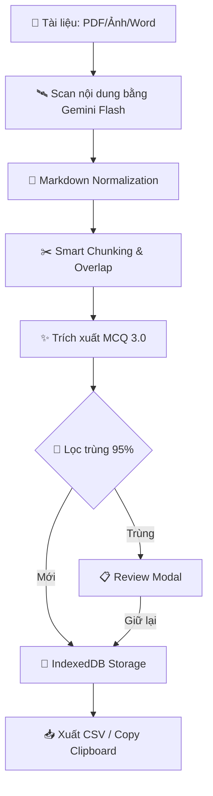

# MCQ AnkiGen Pro — Từ Tài Liệu Đến Thẻ Anki Trong Vài Phút

> **Biến mọi tài liệu Y khoa (scan mờ, ảnh chụp vội, PDF nặng) thành bộ thẻ Anki chất lượng cao chỉ trong vài phút.**
> *Developed by [PonZ](https://github.com/tranhoait123)*

---

[ [🇻🇳 Tiếng Việt](README.md) | [🇺🇸 English](README.en.md) ]

## Mục Lục

1. [Giới thiệu](#giới-thiệu)
2. [Kiến Trúc Hệ Thống](#kiến-trúc-hệ-thống)
3. [Dùng Online — Không Cần Cài Đặt](#dùng-online---không-cần-cài-đặt)
4. [Video Hướng Dẫn & File Mẫu](#video-hướng-dẫn--file-mẫu)
5. [Lấy Google Gemini API Key](#lấy-google-gemini-api-key-miễn-phí)
6. [Hướng dẫn sử dụng chi tiết](#hướng-dẫn-sử-dụng-chi-tiết)
7. [Deep Dive: Công Nghệ Trích Xuất 3.0](#deep-dive-công-nghệ-trích-xuất-30)
8. [Import CSV vào Anki](#import-csv-vào-anki)
9. [Cài đặt chạy trên máy](#cài-đặt-chạy-trên-máy-tùy-chọn)
10. [Công Nghệ Sử Dụng](#công-nghệ-sử-dụng-tech-stack)
11. [Bảo Mật & Quyền Riêng Tư](#bảo-mật--quyền-riêng-tư)
12. [Lộ Trình Phát Triển](#lộ-trình-phát-triển-roadmap)
13. [Đóng Góp](#đóng-góp-contributing)
14. [Mẹo nâng cao & Xử lý lỗi](#mẹo-nâng-cao--xử-lý-lỗi)
15. [Câu hỏi thường gặp](#câu-hỏi-thường-gặp-faq)
16. [Nhật Ký Cập Nhật](#nhật-ký-cập-nhật)
17. [Giấy Phép](#giấy-phép-license)

---

## Giới thiệu

🧠 **MCQ AnkiGen Pro** là công cụ mã nguồn mở giúp bạn:

| Tính năng | Mô tả |
| :--- | :--- |
| 🤖 **Trích xuất MCQ 3.0** | Công cụ AI thế hệ mới, tự động sửa lỗi quét mờ, gối đầu trang và xử lý JSON cực kỳ ổn định |
| 🩺 **Giải thích như Giáo sư Y khoa** | Mỗi câu hỏi đều kèm: đáp án cốt lõi, phân tích sâu, bằng chứng y văn, cảnh báo lâm sàng |
| 💾 **Pro Storage (Safe)** | Dữ liệu được lưu an toàn với ID duy nhất — không lo mất dữ liệu khi reload hay lỗi trình duyệt |
| 🔄 **Lọc trùng Y khoa (95%)** | Thuật toán so sánh nội dung đạt độ chính xác 95%, nhận diện logic phủ định (KHÔNG/NGOẠI TRỪ) |
| 🌙 **Dark Mode & Split View** | Học đêm không mỏi mắt, đối chiếu tài liệu gốc và kết quả song song |

---

## Kiến Trúc Hệ Thống

🏗️ Dữ liệu của bạn được xử lý qua quy trình khép kín đảm bảo tính toàn vẹn và độ chính xác:



---

## Dùng Online — Không Cần Cài Đặt

⚡ **Đây là cách đơn giản nhất để bắt đầu** — chỉ cần trình duyệt và API Key!

### 👉 Truy cập ngay: [mcqankigen.drponz.com](https://mcqankigen.drponz.com/)

Ứng dụng đã được deploy online, bạn có thể sử dụng **ngay lập tức** trên mọi thiết bị (PC, Mac, điện thoại, tablet) mà **không cần cài đặt bất cứ thứ gì**.

### Chỉ cần 3 bước không dấu

```text
 ┌──────────────────────────────────────────────────────────────┐
 │                                                              │
 │   Bước 1 ─ Mở  https://mcqankigen.drponz.com/               │
 │   Bước 2 ─ Lấy API Key miễn phí (xem hướng dẫn bên dưới)   │
 │   Bước 3 ─ Tải file lên → Quét → Trích xuất → Xuất CSV!     │
 │                                                              │
 └──────────────────────────────────────────────────────────────┘
```

| Ưu điểm | Chi tiết |
| :--- | :--- |
| ✅ **Không cần cài đặt** | Mở link, dùng ngay |
| ✅ **Miễn phí 100%** | Chỉ cần API Key Google (miễn phí) |
| ✅ **Đầy đủ tính năng** | Dark Mode, Split View, chỉnh sửa, lọc, xuất CSV |
| ✅ **Mọi thiết bị** | PC, Mac, điện thoại, tablet — chỉ cần trình duyệt |
| ✅ **Dữ liệu an toàn** | Mọi xử lý diễn ra trên trình duyệt, không lưu trên server |
| ✅ **Luôn cập nhật** | Tự động có phiên bản mới nhất mỗi khi truy cập |

> 💡 **Trên điện thoại:** Bạn có thể thêm trang web vào màn hình chính (Add to Home Screen) để sử dụng như một ứng dụng native!

---

## Video Hướng Dẫn & File Mẫu

🎬 Xem video demo toàn bộ quy trình:

### Video Demo

<https://github.com/user-attachments/assets/huong-dan-su-dung.mov>

> 📹 File video có sẵn trong repo: [`Hướng dẫn sử dụng.mov`](./Hướng%20dẫn%20sử%20dụng.mov)

### File Mẫu — Xem Thành Quả Ngay

📦 Muốn xem kết quả thực tế trước khi bắt đầu? Import file demo vào Anki để trải nghiệm:

| File | Mô tả | Tải |
| :--- | :--- | :--- |
| **DEMO.apkg** | 🎉 Bộ thẻ mẫu đã trích xuất sẵn | [📥 Tải DEMO.apkg](./DEMO.apkg) |
| **3MCQ.apkg** | 📋 Note Type "3MCQ" tối ưu cho app | [📥 Tải 3MCQ.apkg](./3MCQ.apkg) |

> 💡 Mở Anki → **File → Import** → chọn file `DEMO.apkg` để xem ngay bộ thẻ trắc nghiệm mẫu với đầy đủ câu hỏi, đáp án và giải thích chi tiết!

---

## Lấy Google Gemini API Key Miễn Phí

🔑 API Key là "chìa khóa" để ứng dụng giao tiếp với AI của Google. Bạn được sử dụng **hoàn toàn miễn phí** trong giới hạn cá nhân.

### Các bước thực hiện không dấu

1. Truy cập [Google AI Studio](https://aistudio.google.com/app/apikey)
2. Đăng nhập bằng tài khoản Google của bạn
3. Nhấn nút **"Create API Key"** (Tạo API Key)
4. Chọn một dự án Google Cloud (hoặc để mặc định), rồi nhấn **"Create"**
5. Sao chép API Key hiển thị (dạng `AIzaSy...`) — lưu lại cẩn thận!

> ⚠️ **Bảo mật API Key:** Không chia sẻ Key cho người khác.

### Mẹo: Tạo nhiều API Key từ nhiều Project

🔥 Mỗi API Key thuộc một **Google Cloud Project**, và mỗi Project có **quota miễn phí riêng biệt**. Bằng cách tạo nhiều Key từ nhiều Project khác nhau, bạn sẽ **nhân bội** lượng sử dụng miễn phí!

#### Cách tạo nhiều Key không dấu

1. Vào [Google AI Studio → API Keys](https://aistudio.google.com/app/apikey)
2. Nhấn **"Create API Key"**
3. Ở mục **"Google Cloud Project"**, nhấn **"Create new project"** thay vì chọn project cũ
4. Đặt tên project (VD: `anki-key-2`, `anki-key-3`...) → Nhấn **"Create"**
5. Lặp lại Bước 1-4 để tạo thêm Key

> 💡 **Mỗi Project = 1 quota miễn phí riêng.**
>
> - Project 1 → Key A (quota riêng)
> - Project 2 → Key B (quota riêng)
>
> **3 Project = gấp 3 lần quota miễn phí!**

#### Cách nhập nhiều Key vào ứng dụng

Vào **⚙️ Cài đặt → Google Gemini API Key**, dán các Key cách nhau bằng dấu phẩy `,`:

```text
AIzaSyA...,AIzaSyB...,AIzaSyC...
```

---

## Hướng dẫn sử dụng chi tiết

🌐 Các bước dưới đây áp dụng cho cả bản online lẫn bản cài trên máy.

### Bước 1: Cấu hình API Key & Model AI

1. Nhấn vào **biểu tượng ⚙️ (Cài đặt)**
2. Cửa sổ **"Cài đặt hệ thống"** sẽ hiện ra:

| Mục | Hướng dẫn |
| :--- | :--- |
| **Google Gemini API Key** | Dán API Key. *Có thể nhập nhiều key cách nhau bằng dấu phẩy.* |
| **Mô hình AI (Model)** | **Khuyên dùng: `Gemini 3.1 Flash-Lite`** |
| **Vai trò AI** | Chọn vai trò: **Y Khoa**, **Tiếng Anh**, **Luật**, **CNTT** |

1. Nhấn **"Đã Xong"** để lưu.

### Giải mã các Vai trò AI (AI Roles)

🎭 Việc chọn đúng vai trò giúp AI "kích hoạt" đúng vùng kiến thức chuyên biệt:

| Vai trò | Điểm đặc biệt |
| :--- | :--- |
| 🩺 **Y Khoa** | Tập trung vào triệu chứng, chẩn đoán, điều trị và y văn. |
| 🔠 **Tiếng Anh** | Chú trọng ngữ pháp, từ vựng, ngữ cảnh. |
| ⚖️ **Luật** | Trích dẫn chính xác điều luật, khoản, mục. |
| 💻 **CNTT** | Trích xuất code, giải thích thuật toán. |

---

### Bước 2: Tải tài liệu lên

Ở phần **Control Panel** (bên trái):

1. **Kéo thả file** hoặc **nhấn để chọn file**
2. Hệ thống hỗ trợ: **PDF**, **Ảnh**, **Word (DOCX)**, **Text**
3. Có thể tải **nhiều file cùng lúc**
4. Chờ trạng thái hiển thị **"Đã sẵn sàng"**

---

### Bước 3: Quét & Trích xuất câu hỏi

Quy trình gồm **2 giai đoạn** tuần tự:

#### Giai đoạn 1 — Quét tài liệu (Scan)

1. Nhấn nút **"🛰️ QUÉT TÀI LIỆU"**
2. AI sẽ phân tích chủ đề và số câu ước tính
3. Chờ trạng thái **"Hệ thống đã sẵn sàng"**

#### Giai đoạn 2 — Trích xuất câu hỏi (Extract)

1. Nhấn nút **"✨ TRÍCH XUẤT CÂU HỎI"**
2. Hệ thống sẽ tự động quét song song và lọc trùng
3. Theo dõi tiến trình trên thanh trạng thái

---

### Bước 4: Xem, chỉnh sửa & lọc kết quả

Kết quả hiển thị ở **panel bên phải**:

#### Thanh công cụ 🔍

| Nút | Chức năng |
| :--- | :--- |
| **🔎 Tìm kiếm** | Lọc câu hỏi theo từ khóa |
| **📊 Lọc độ khó** | Lọc Easy / Medium / Hard |
| **✏️ Soạn / 👁️ Review** | Chuyển đổi chế độ xem |

#### Chỉnh sửa câu hỏi ✏️

- Hover lên câu hỏi để hiện nút **🖊 Sửa** hoặc **🗑 Xóa**
- Khi chỉnh sửa:
  - Nhấn **"Lưu thay đổi"** (`Ctrl+Enter`)
  - Nhấn **"Hủy bỏ"** (`Escape`)

#### Chế độ Split View (So sánh) 🔀

Nhấn nút **📊 (Columns)** ở Header để đối chiếu tài liệu gốc và kết quả trích xuất.

---

### Bước 5: Xuất file CSV

1. Nhấn **📋 Copy CSV** hoặc **📥 Xuất CSV Anki**
2. File CSV có cấu hình chuẩn: `Question | A | B | C | D | E | CorrectAnswer | ExplanationHTML | Source | Difficulty`

---

## Deep Dive: Công Nghệ Trích Xuất 3.0

Phiên bản **Ultima (v5.2)** tập trung vào độ tin cậy tuyệt đối cho dữ liệu Y khoa:

### 🔬 Thuật toán so sánh vân tay (Fingerprinting)

- Loại bỏ số thứ tự, chuẩn hóa khoảng trắng.
- Sử dụng khoảng cách **Levenshtein** để tính độ tương đồng.
- **Ngưỡng 95%**: Đảm bảo không bỏ sót các ca lâm sàng gần giống nhau.

### 🛡️ Cơ chế "Pháp y tài liệu"

- Tự nối câu hỏi giữa các trang PDF.
- Sửa lỗi OCR thông minh.
- Định dạng bảng biểu vào cột `Explanation`.

---

## Import CSV Và Anki

### Bước 1: Mở Anki Desktop

Tải Anki tại <https://apps.ankiweb.net/>.

### Bước 2: Chọn Note Type

#### ⚡ Cách nhanh: Dùng Note Type "3MCQ" có sẵn

1. [📥 Tải file 3MCQ.apkg](./3MCQ.apkg)
2. Mở Anki → **File → Import** → chọn file vừa tải
3. Note Type "3MCQ" sẽ tự động được thêm vào.

#### 🔧 Cách thủ công: Tự tạo Note Type

Tạo Note Type mới với 10 trường tương ứng như trong cấu hình file CSV.

### Bước 3: Import CSV

1. **File → Import** → Chọn file CSV
2. Chọn Type: **3MCQ**
3. **Allow HTML in fields**: ✅ **BẬT**
4. Nhấn **Import**

---

## Cài Đặt Chạy Trên Máy Tùy Chọn

> 📝 Chỉ dành cho chạy offline.

#### 1. Tải mã nguồn

```bash
git clone https://github.com/tranhoait123/anki-mcq-export.git
cd anki-mcq-export
```

#### 2. Cài thư viện

```bash
npm install
```

#### 3. Khởi chạy

```bash
npm run dev
```

---

## Công Nghệ Sử Dụng Tech Stack

- **Frontend**: React 18, Vite ⚡
- **State**: Zustand 📦
- **Styling**: Tailwind CSS (Glassmorphism)
- **Notifications**: Sonner 🍎
- **Storage**: IndexedDB (Local persistence)
- **AI Engine**: Google Gemini API 🤖

---

## Bảo Mật & Quyền Riêng Tư

🛡️ Dữ liệu của bạn được bảo vệ tối đa:
- **Local-First**: Xử lý ngay trên trình duyệt.
- **Zero Server**: Không lưu trữ API Key hay tài liệu trên máy chủ trung gian.

---

## 🐍 Phiên Bản Streamlit (Python)

```bash
# Cài đặt
pip install -r requirements.txt
# Chạy
streamlit run streamlit_app.py
```

---

## Mẹo nâng cao & Xử lý lỗi

### ❌ Lỗi thường gặp

| Lỗi | Giải pháp |
| :--- | :--- |
| **API 429** | Thêm nhiều API Key, hệ thống tự xoay vòng |
| **Ít câu hỏi** | Kiểm tra độ nét tài liệu hoặc dùng Gemini 3 Pro |
| **Data Loss** | Kiểm tra IndexedDB trong tab Application của DevTools |

### 💡 Mẹo tối ưu

- Sử dụng **Overlap Scanning** (Quét gối đầu 3 trang) để không mất câu hỏi cuối trang.
- Lưu trữ vĩnh viễn trên trình duyệt, không lo mất dữ liệu khi F5.

---

## Câu hỏi thường gặp FAQ

- **Có miễn phí không?** Có, 100% mã nguồn mở.
- **Dữ liệu đi đâu?** Trực tiếp từ máy bạn đến Google Gemini.
- **Dùng cho môn khác được không?** Được, chỉ cần đổi Vai trò AI.

---

## Nhật Ký Cập Nhật

| Phiên bản | Mô tả |
| :--- | :--- |
| **v5.2** | Medical Extraction 3.0, 95% Precision, Duplicate Review UI |
| **v5.1** | Robust MCQ Normalization, Đáp án chính xác 100% |
| **v5.0** | Zustand Architecture, Sonner Toasts |

---

## Giấy Phép License

Dự án phát hành dưới giấy phép **MIT**.

---

**Phát triển bởi [PonZ](https://github.com/tranhoait123)** 🩺
